# 项目创建

## 配置docker环境

### 云服务器中的配置

在AC Terminal中拿到.tar压缩包后，将其解压成一个docker镜像：

`docker load -i django_lesson_1_0.tar`

等待解压结束，会生成一个镜像（image），输入`docker images`可查看。

然后，输入`docker run -p 20000:22 -p 8000:8000 --name django_server -itd django_lesson:1.0`。（端口映射：20000->22：方便登录；8000->8000：方便调试；并取名为django_server）

> 一定要确保这两个端口是开启状态，否则就去手动打开云服务器的20000端口和8000端口。

接下来进入该容器：`docker attach django_server`

创建新用户，因为最好不要在root用户下直接进行操作

```
adduser ray  # 添加新用户ray
# 输入密码，一直回车
usermod -aG sudo ray  # 为ray用户配置sudo权限
```

然后按`Ctrl + P`后再按`Ctrl + Q`挂起容器，一定不要按`Ctrl + D`，`Ctrl + D`是停止容器而不是挂起！

### AC Terminal中的配置

配置ssh登录：

```
cd .ssh/
vim config
#  配置别名
	Host django
		HostName xx.xxx.xxx.xxx
		User ray
		Port 20000

ssh django  # 登录成功！
```

配置免密登录：

```
ssh-copy-id django
# 输入密码
```

将AC Terminal上的配置传到django服务器上

```
scp .bashrc .vimrc .tmux.conf django:
```

## 创建django项目

```
django-admin --version  # 查看版本：3.2.8
django-admin startproject acapp  # 创建项目：名字为acapp
cd acapp/
git init  # 写项目前一定要用git维护起来
# 使用git前，要生成ssh key
cd   # 回到家目录
ssh-keygen  # 一直回车
# 初始化git
git config --global user.name "hitoriray"
git config --global user.email "676155220@qq.com"
```

在云端创建一个项目，然后push上去。

```
# 先配置ssh登录github
ssh-keygen  # 然后一直回车
cd ~/.ssh/
cat id_rsa.pub
# 复制公钥到github上
ssh-rsa AAAAB3NzaC1yc2EAAAADAQABAAABgQC8+A3shLY5TsGdOG0xTSXsC5ypJ8DnVQnvBWdieRkbyNAkBr4PRqiAF4vqhliiAcKpJ3me8OF5ZchVREXHqyWnmo3fhemeRfGJPC4b1rZSgyuB6t2ynymq8O6WqduQIalYygoQOke1ZNbHOaESHxo1iWDiXTG4QXJ7L2R4J+fxUceDGew4JwwIecJuctdHL9EPNjq0NvnsLfK64gN2ae3FiVuAGL86Vpzg3lHJKLy88fYEOUWa+G9oytaN/YJXMZyYGX8kL1bqY4cg5bxrwo+9L6/tRPHs0vSDgHcahZv6ZF1vn3GpJjH++Sl82cCrKjCn8wgMrQPZu3XpqSwxbi8LoDoHzTr00BN0W/kARUQZWQBQtncILs7XgUGJ9kSlapg+xt4RQnWTvgTuFZovfWmh7qEKSdHiVKciG4zKWG9HDNTKq/sUh6PX13ilXv6cZB8aNmrdCcepU2mi1bFSxWzv6rdbwpJ/OqQp/DrY2lSoJDoHfxuBXGhrvnjbe9sOWP8= ray@1141a294aa4d
# 打开 github -> Settings -> SSH and GPG keys -> New SSH key
# 然后再git到github上
git add .
git commit -m "start project"
git remote add origin git@github.com:hitoriray/acapp.git
git push  # 会提示加上下面这句话
git push --set-upstream origin master
```

此时就完成了git操作。

接下来跑一下项目看看能不能跑起来：`python3 manage.py runserver 0.0.0.0:8000`

打开网页：47.122.38.144:8000，如下图所示：

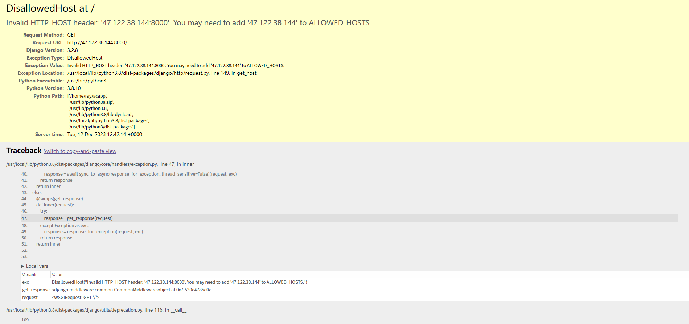

将47.122.38.144加到ALLOW_HOSTS中

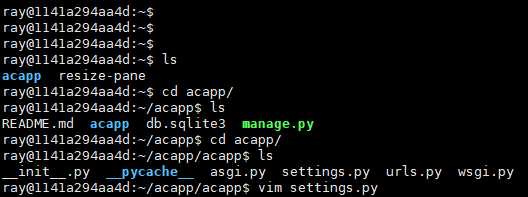


保存退出后，刷新一下网页，如下图所示，说明成功运行django

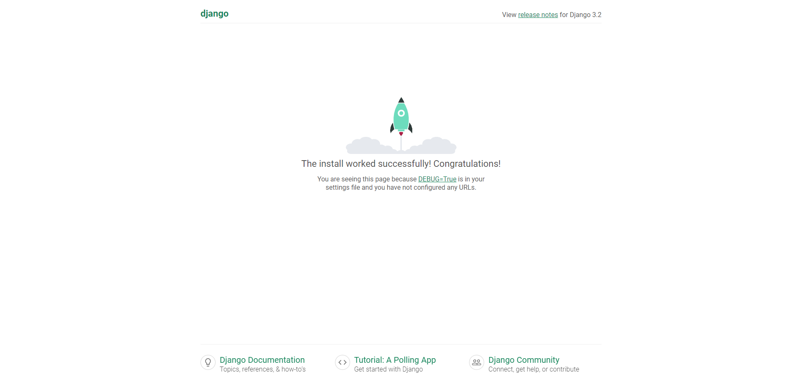

然后在项目的根目录下添加.gitignore文件，输入`*/__pycache__`。

再git一下就行了。

## 创建app

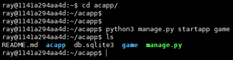

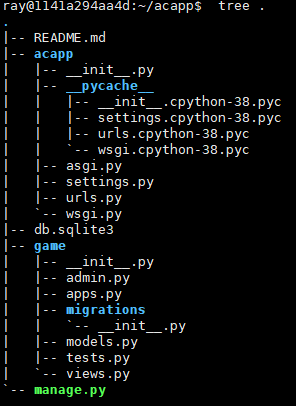

其中：

`admin.py`存储管理员页面，管理员能看到的数据库

`apps.py`用的不多，只会用到一次

`migrations`是系统文档，不用管

`models.py`用来定义网站里各种数据库表的

`tests.py`不用管

`views.py`写视图的，也就是写函数的地方

创建完后不要忘了git维护~

****

将数据库的内容更新上去，重新运行一遍后会发现：

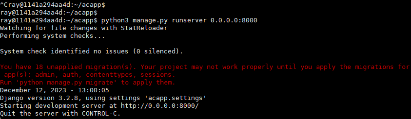

没有将数据库的修改同步，因此需要进行同步。

执行提示命令`python3 manage.py migrate`后

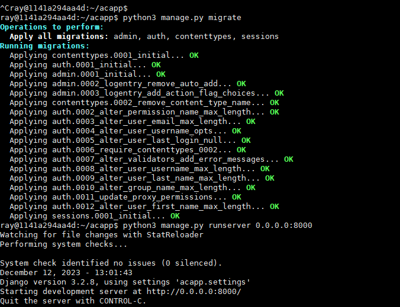

就可以正常打开admin页面了

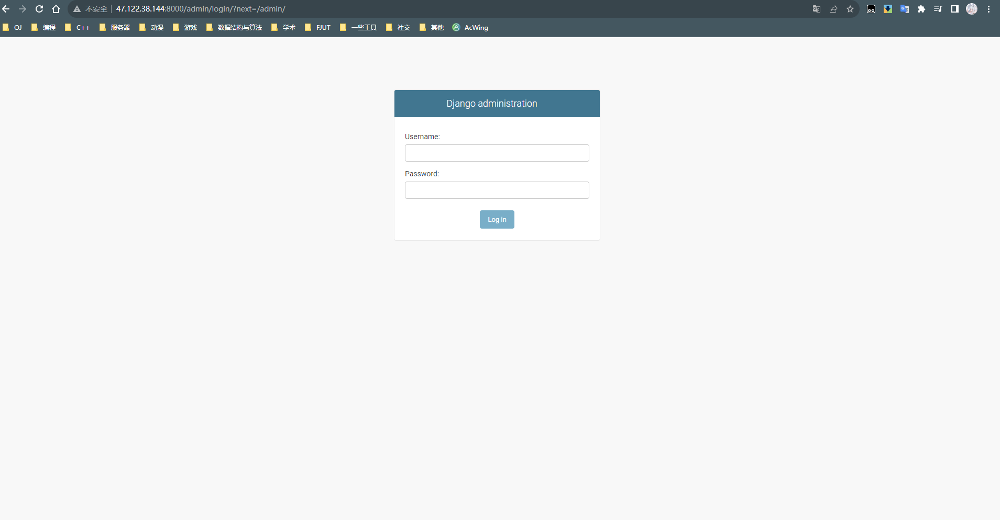

创建管理员账号

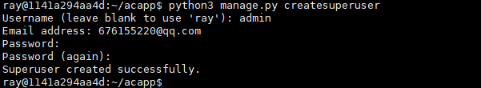

成功登录！

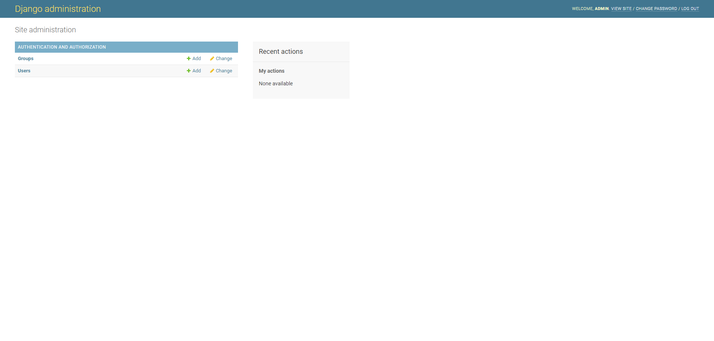

## 创建自己的页面

最关键的三个东西：`models.py`、`views.py`、`urls.py`（需手动创建），以及一个templates文件夹

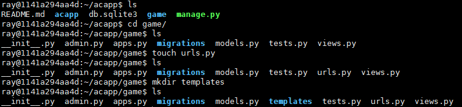

接下来整个项目需要操作的就这四个东西了。当三个文件中的任一个文件过大时，可以合并成一个文件夹，然后在文件夹中再细分成n个文件。这在python中很容易就能够实现。

>models.py ：存数据结构
>
>views.py：存视图，即函数
>
>urls.py：路由，根据url的格式去判断该调用哪个函数
>
>templates：存html

- 在views中实现一个最简单的函数

`views.py`

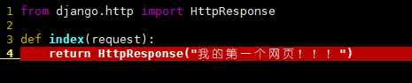

`urls.py`

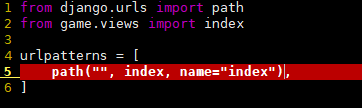

`acapp/acapp/urls.py`原图

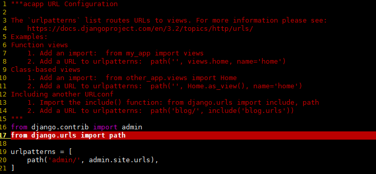

修改成如下图所示：

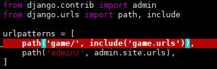

打开了第一个网页！！！`47.122.38.144:8000/game/`

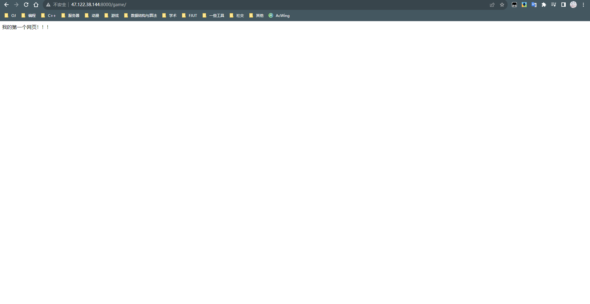

在只有一个项目的情况下可以不加'game/'：

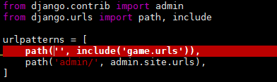

这样只要打开网页`47.122.38.144:8000`就可以到上面那个页面了。

****

操作详解：

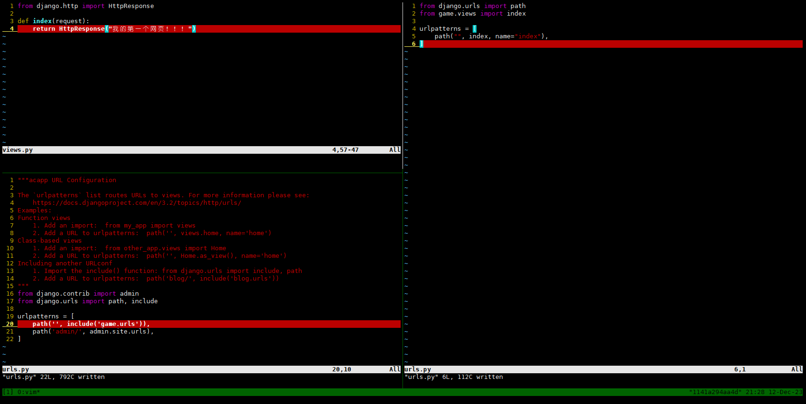

用户打开网页，服务器收到请求：传递给`acapp/urls.py`，然后第一个path接受到请求，再传递给include，即`game/urls.py`中的path接收到了请求，然后再传递给`game/views.py`里的index函数，index函数里面有什么，网页就展示什么。

例如：

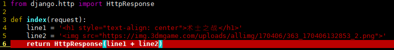

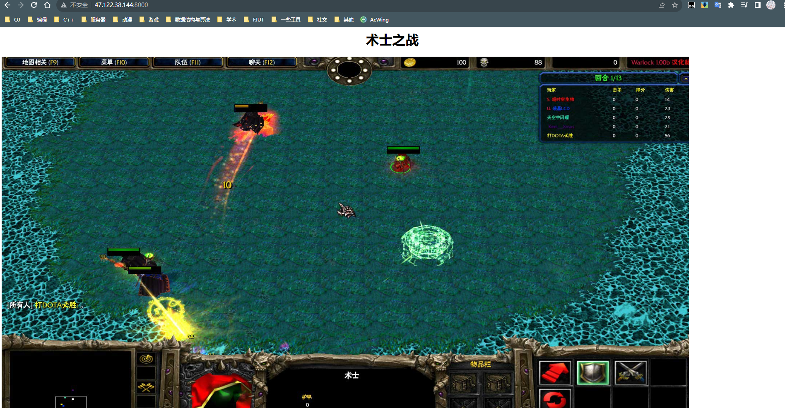

**创建一个新页面：**

`views.py`：

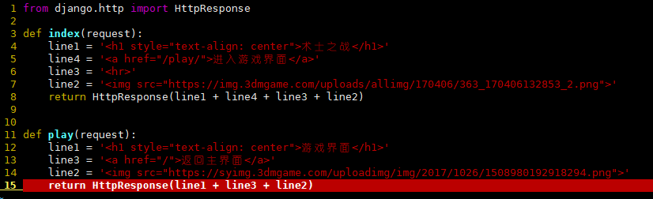

`urls.py`：

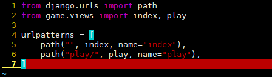

****

