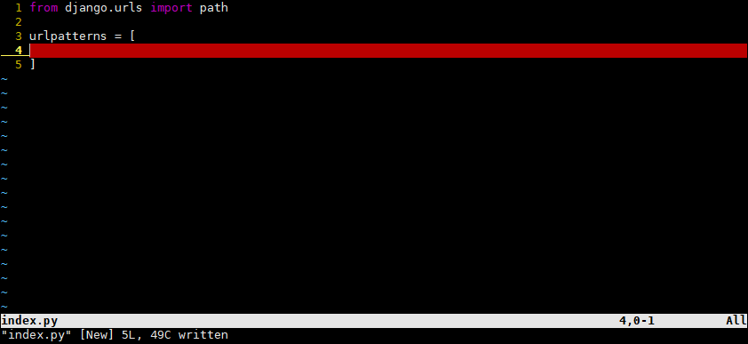

# 菜单界面

## 项目系统设计

- menu：菜单页面
- playground：游戏界面
- settings：设置界面


## 项目文件结构

在未来代码变得越来越多的时候，把所有代码放在一个文件中会显得难以管理，因此要把它们放在文件夹中再细分管理，如：把views.py放在新建文件夹views中，把urls.py放在新建文件夹urls中，把models.py放在新建文件夹models中……


然后还要新建一个文件夹`static`，用于存储静态文件，如：`css文件`、`js文件`、`image图片`、`audio声音`……

- `templates`目录：管理`html`文件

- `urls`目录：管理路由，即链接与函数的对应关系

- `views`目录：管理`http`函数

- `models`目录：管理数据库数据

- `static`目录：管理静态文件，比如：
  - `css`：对象的格式，比如位置、长宽、颜色、背景、字体大小等
  
  - `js`：对象的逻辑，比如对象的创建与销毁、事件函数、移动、变色等
  
  - `image`：图片
  
  - `audio`：声音
  
  - …
  
- consumers目录：管理`websocket`函数（例如管理聊天的逻辑就放在这里）

> urls、views、models这三个文件夹都是存放python文件，因此需要添加`__init__.py`（记得把这三个文件夹对应的.py文件删掉）


然后要在全局的urls.py中修改path（先注释掉，待会写完了再来修改）


重新启动网页：


每刷新一次就会多一条这样的消息，我们发现这个时间会比本地时间晚8小时，此时本地时间为`12:43`。

### 修改为中国时区


在settings.py中找到如下图所示：

把UTC时区修改为中国时区：

修改成功：

### 加载app


将这个GameConfig类加到settings中：


添加到INSTALLED_APPS中：


### 设置静态文件地址

在settings.py中：


添加：


表示将静态文件放在`static`目录下（需要在开头import os）

再加上media相关配置：


其中一般`static`存开发者静态文件，`media`存用户的静态文件。

然后回到static文件夹中，创建相关文件：


> 管理项目的技巧：在每个文件夹中创建项目对应的模块，例如：templates中创建menu，playground，settings对应的三个模块，urls中一样创建这三个模块，views、models、…… 同理。

创建对应模块以及下载背景图片：


然后就可以访问这个动图了：


### css

一般来说css文件不需要做细分，都写在game.css中即可。


### js

由于文件太多，因此一般分成两个文件夹来写：


`dist`：用来最终使用的js文件

`src`：用来存所有js的源文件

将所有src中的js文件合并成一个js文件放在dist中，写一个脚本就可以实现。

- 创建一个脚本文件专门存放各种脚本：


加上可执行权限：


测试：执行脚本文件后，dist文件夹下会多出一个game.js文件


### templates


其中multiends中存放支持多终端的相关配置


- `jquery`库：

```html
<link rel="stylesheet" href="https://cdn.acwing.com/static/jquery-ui-dist/jquery-ui.min.css">
<script src="https://cdn.acwing.com/static/jquery/js/jquery-3.3.1.min.js"></script>
```


加点内容：


- 回到js/src：


`zbase.js`是因为打包顺序中`zbase.js`一定要放在最后，因为打包是按字典序打包，因此，命名为`zbase.js`。

****

- zbase.js

使用js渲染的原因：多终端、减轻服务器压力。

如果直接写html的话，会在后端渲染，也就是所有用户在调用网页的时候都会在后端渲染完毕后返回给前端，这样对服务器的消耗特别大，但是如果将文件传给用户，那么是在用户的电脑上进行渲染，这样服务器的压力就很小，而且用户的体验也会更好。

每次修改完`zbase.js`后都要重新运行一遍`compress_game_js.sh`。然后`js/dist/game.js`文件就会更新。

****

### views

返回html的，也就是返回数据的。


然后需要写一个`index.py`，主要是返回html文件，只会在web端被调用。


这样就写完了，然后要写的是路由。

### urls

同理


在urls文件夹下创建一个`index.py`，用于将urls文件夹下的其他文件夹内的东西include进来。仿照整个项目的总urls去写，在`acapp/urls.py`中。写完后如下图：



然后在urls目录下的menu、playground、settings文件夹中分别创建index.py，写入与上图相同的内容。

再修改urls目录下的index.py：


修改全局函数`acapp/urls.py`，放开之前注释掉的path：


登录到网站上去，我们可以发现按右键->查看网页源码：


发现返回的就是web.html中的内容。

到此为止，前期的准备工作都做好了，接下来就是开始写项目了！！！

****

步骤：先进到acapp中的urls.py中的第一个路径`game.urls.index`，进入game/urls/index.py，里面的第一个路径，调用index函数（来自game.views.index.index函数），返回"multiends/web.html"，进入templates/multiends/web.html，返回这里面的内容。


21.46