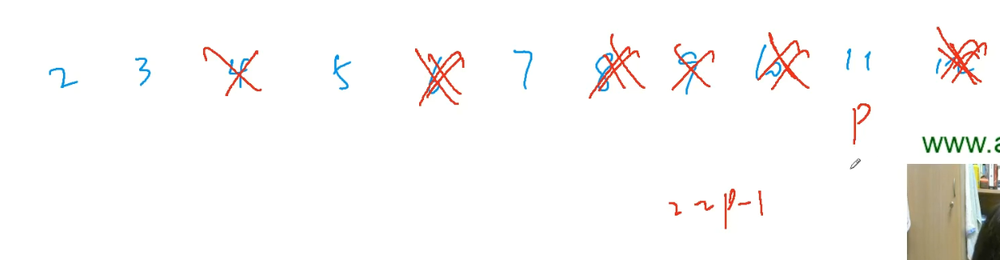
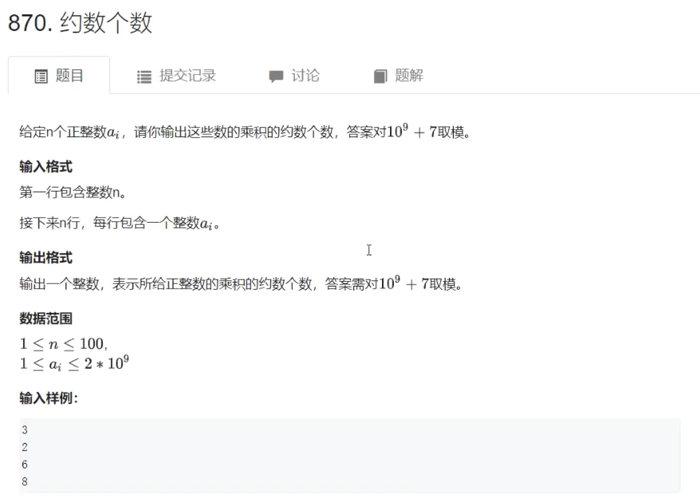

# 数论

## 质数

在大于1的整数中，如果只包含1和本身这两个[约数](https://baike.baidu.com/item/%E7%BA%A6%E6%95%B0/0?fromModule=lemma_inlink)，就被称为[质数](https://baike.baidu.com/item/%E8%B4%A8%E6%95%B0/0?fromModule=lemma_inlink)，或者叫素数。

### 质数的判定 —— 试除法

> 时间复杂度：$O(\sqrt n)$

```C++
// 最简单、最暴力的写法。时间复杂度：O(n)
bool is_prime(int n)
{
    if (n < 2) return false;
    for (int i = 2; i < n; i ++ )
        if (n % i == 0)
            return false;
    return true;
}
```

- 优化思路

如果一个数$n$存在约数$d$，那么必定存在另一个约数$\frac{n}{d}$，也就是说约数一定是==成双成对存在==的，所以只要找到较小的那个约数即可判定这个数不是素数。

即 $d \leqslant \frac{n}{d}$  即 $d^2 \leqslant n$ 即 $d \leqslant \sqrt{n}$

```C++
// 优化版。时间复杂度：O(√n)
bool is_prime(int n)
{
    if (n < 2) return false;
    for (int i = 2; i <= n / i; i ++ )
        if (n % i == 0) // 找到了约数，证明不是素数
            return false;
    return true;
}
// 不推荐 i <= sqrt(n) 这种写法，因为每次循环都要调用sqrt函数，比较慢。
// 也不推荐 i * i <= n 这种写法，当n比较接近于int的最大值时存在溢出风险。
// 推荐写法：i <= n / i 既不会溢出，速度也不会慢。
```

****

### [分解质因数](https://baike.baidu.com/item/%E5%88%86%E8%A7%A3%E8%B4%A8%E5%9B%A0%E6%95%B0/0?fromModule=lemma_inlink) —— 试除法

> 时间复杂度：最坏$O(\sqrt{n})$，最好$O(\log n)$

+ 思路：从小到大枚举所有数
+ 代码

```C++
// 朴素版代码
void divide(int n)
{
    for (int i = 2; i <= n; i ++ )
        if (n % i == 0) // 代码运行到这里的话表示i一定是一个质数
        {
            int s = 0;
            while (n % i == 0)
            {
                n /= i;
                s ++ ;
            }
            
            printf("%d %d\n", i, s);
        }
}

// 优化版代码
// 由于n中最多只包含一个大于√n的质数（质因子）
// 因此只要单独处理这个数即可，时间复杂度从O(n)降到O(√n)
void divide(int n)
{
    for (int i = 2; i <= n / i; i ++ )
        if (n % i == 0) // 代码运行到这里的话表示i一定是一个质数
        {
            int s = 0;
            while (n % i == 0)
            {
                n /= i;
                s ++ ;
            }
            
            printf("%d %d\n", i, s);
        }
    
    if (n > 1) printf("%d %d\n", n, 1); // 最后输出比较大的那个质因数
    puts("");
}
```


****

### 筛质数



**思路：把`1~n`存放到一个数组中，从前往后遍历每个数，每次把这个数的所有倍数删掉，最后在数组的没被删掉的都是质数。**

#### 1. 朴素筛法

> 时间复杂度：$O(n\log n)$

- 时间复杂度证明


因为 $\frac{n}{2} + \frac{n}{3} + ... + \frac{n}{n} = n(\frac{1}{2} + \frac{1}{3} + ... + \frac{1}{n})$

又因为

$n(\frac{1}{2} + \frac{1}{3} + ... + \frac{1}{n}) 是一个调和级数，当 n \to \infty 时，它等于\ln n + c\ \ (c为欧拉常数:0.577左右,是一个无限不循环小数)$ 

所以  $n(\frac{1}{2} + \frac{1}{3} + ... + \frac{1}{n}) \approx n \ln n = n log_e n < n log_2 n = n log n$

- 代码

```C++
#include <iostream>
#include <algorithm>
#include <cstring>

using namespace std;

const int N = 1000010;

int primes[N], cnt;
bool st[N];

void get_primes(int n)
{
    for (int i = 2; i <= n; i ++ )
    {
        if (!st[i]) primes[cnt ++ ] = i;
        for (int j = i + i; j <= n; j += i) st[j] = true;
    }
}

int main()
{
    int n;
    cin >> n;

    get_primes(n);

    for (int i = 0; i < cnt; i ++ ) cout << primes[i] << endl; // 输出1~N内所有质数

    return 0;
}
```


- 优化思路：当一个数不是质数的话，就不需要删掉它的所有倍数。

#### 2. 埃氏筛法

> 时间复杂度：粗略估计$O(n)$，真实$O(n\log\log n)$

+ 埃拉托斯特尼筛法的过程

考虑这样一件事情：对于任意一个大于$1$的正整数$n$，那么它的$x$倍就是合数$(x>1)$。利用这个结论，我们可以避免很多次不必要的检测。

如果我们从小到大考虑每个数，然后同时把当前这个数的所有（比自己大的）倍数记为合数，那么运行结束的时候没有被标记的数就是质数了。

- 代码

```C++
void get_primes(int n)
{
    for (int i = 2; i <= n; i ++ )
        if (!st[i])
        {
            primes[cnt ++ ] = i;
            for (int j = i + i; j <= n; j += i) st[j] = true;
        }
}
```


#### 3. 线性筛法（常用）

> 时间复杂度：$O(n)$

埃氏筛法仍有优化空间，因为它会将一个合数重复多次标记。有没有什么办法省掉无意义的步骤呢？答案是肯定的。

如果能让每个合数都只被标记一次，那么时间复杂度就可以降到$O(n)$了。

+ 核心原理：$n$只会被它的最小质因子筛掉，即不会重复筛掉一个数。

1. $若i \% p_j = 0，p_j一定是i的最小质因子，p_j一定是p_j \times i的最小质因子。$ 
2. $若i \% p_j \neq 0，p_j一定小于i的所有质因子，p_j也一定是p_j \times i 的最小质因子。$
3. $对于一个合数x(x一定存在一个最小质因子)，假设p_j是x的最小质因子，当i枚举到\frac{x}{p_j}的时候，就会把x筛掉。$

- 筛掉的一定是合数，且一定是用其最小质因子筛的（$p_j$一定不大于$i$的所有质因子）
- 合数是否一定会被筛掉？
  - 答案是肯定的，$N=p\frac{N}{p},p\le \frac{N}{p}的最小质因子$
  - 当$i=\frac{N}{p}<N时，p·i=N$

```C++
const int N = 1000010;

int primes[N], cnt; // 存所有质数
bool st[N]; // 记录当前数有没有被筛过
int minp[N]; // 存每个数的最小质因子

void get_primes(int n)
{
    for (int i = 2; i <= n; i ++ )
    {
        if (!st[i]) minp[i] = i, primes[cnt ++ ] = i;
    	for (int j = 0; primes[j] <= n / i; j ++ )
        {
            st[primes[j] * i] = true;
            minp[primes[j] * i] = primes[j];
            if (i % primes[j] == 0) break;  // primes[j]一定是i的最小质因子
        }
    }
}
```

****

## 约数

[约数](https://baike.baidu.com/item/%E7%BA%A6%E6%95%B0/0?fromModule=lemma_inlink)（英文名称：divisor），又称[因数](https://baike.baidu.com/item/因数/9539111?fromModule=lemma_inlink)。

### 试除法求一个数的所有约数

> 时间复杂度：$O(\sqrt n)$

由于约数是成对出现的，因此只要枚举到较小的那个约数，那么另一个较大的约数也就出来了。

一般情况下，一个数的约数个数是$\log n$个，那么`sort`函数的时间复杂度是$O(n\log n)$ 也就是 $O(\log n \log\log n)$，这个时间复杂度小于$O(\sqrt n)$。

所以整体的时间复杂度就是$O(\sqrt n)$。

```C++
#include <iostream>
#include <vector>
#include <algorithm>

using namespace std;

vector<int> get_divisors(int n)
{
    vector<int> res;
    
    for (int i = 1; i <= n / i; i ++ )
        if (n % i == 0)
        {
            res.push_back(i);
            if (i != n / i) res.push_back(n / i); // 边界特判：防止添加两个相同的数i（i^2 == n）
        }
    
    sort(res.begin(), res.end());
    return res;
}

int main()
{
    int n;
    cin >> n;
    
    while (n -- )
    {
        int x;
        cin >> x;
    	auto res = get_divisors(n);
        for (const auto& e : res) cout << e << ' ';
        cout << endl;
    }
    
    return 0;
}
```

****

### 约数个数

任何一个整数$N$，假设它分解完所有质因数后的结果是：**$N = p_1^ {\alpha_1}·p_2^ {\alpha_2} ... p_k^ {\alpha_k}$**

==那么$N$的约数个数就是：$(\alpha_1 + 1)·(\alpha_2 + 1) ... (\alpha_k + 1)$==

**在int范围内，约数个数最多有$1500$个左右。**

+ 题目



```
输入
3
2
6
8
输出
12
```

+ 代码

```C++
#include <iostream>
#include <unordered_map>
#include <algorithm>

using namespace std;

typedef long long LL;

const int MOD = 1e9 + 7;

int main()
{
	int n;
	cin >> n;

	unordered_map<int, int> primes; // key：底数，value：指数
	while (n -- )
	{
		int x;
		cin >> x;

		for (int i = 2; i <= x / i; i ++ )
			while (x % i == 0)
			{
				x /= i;
				primes[i] ++ ; // i的质因数的指数+1
			}

		if (x > 1) primes[x] ++ ; // 不漏
	}

	LL res = 1;
	for (auto prime : primes) res = (LL)res * (prime.second + 1) % MOD; // 每一步都要加上LL和MOD，防止爆int

	cout << res << endl;

	return 0;
}
```

****


### 约数之和

任何一个整数$N$，假设它分解完所有质因数后的结果是：**$N = p_1^ {\alpha_1}·p_2^ {\alpha_2} ... p_k^ {\alpha_k}$**

==那么$N$的约数之和就是：$(p_1^0 + p_1^1 + p_1^2 + ... + p_1^{\alpha_1})·(p_2^0 + p_2^1 + p_2^2 + ... + p_2^{\alpha_2}) \cdots (p_k^0 + p_k^1 + p_k^2 + ... + p_k^{\alpha_k})$==

+ 题目


```
输入
3
2
6
8
输出
252
```

+ 代码

```C++
#include <iostream>
#include <algorithm>
#include <unordered_map>

using namespace std;

typedef long long LL;

const int MOD = 1e9 + 7;

int main()
{
	int n;
	cin >> n;

	unordered_map<int, int> primes;
	while (n -- )
	{
		int x;
		cin >> x;
		for (int i = 2; i < x / i; i ++)
			while (x % i == 0)
			{
				x /= i;
				primes[i] ++ ;
			}
		if (x > 1) primes[x] ++ ;
	}

	LL res = 1;
	for (const auto& prime : primes)
	{
		int p = prime.first, a = prime.second; // p为底数，a为指数
		LL t = 1;
		while (a -- ) t = (t * p + 1) % MOD; // 求p_i的0次方一直到a次方之和
		res = res * t % MOD;
	}

	cout << res << endl;

	return 0;
}
```


*****

### 求最大公约数

#### 1. [欧几里得算法](https://zh.wikipedia.org/wiki/%E8%BC%BE%E8%BD%89%E7%9B%B8%E9%99%A4%E6%B3%95)（辗转相除法）

​	==$时间复杂度：O(\log n)$==

+ 核心原理

如果$d$能整除$a$并且$d$能整除$b$的话，那么$d$就能够整除$a+b$，也能整除$ax+by (x,y可以取任意值)$

所以$a和b$的最大公约数就等于$b和a\% b$的最大公约数：==$(a, b) = (b, a\%b)$==

证明：$a \% b = a - \lfloor \frac{a}{b} \rfloor·b = a - c·b (c为整数:\lfloor \frac{a}{b} \rfloor)$

所以$(a, b) = (b, a - c·b)$

$所以(a, b) = (b, a\%b)成立。$

```c++
#include <iostream>

using namespace std;

int gcd(int a, int b)
{
	return b ? gcd(b, a % b) : a;
}

int main()
{
	int n;
    cin >> n;
    while (n -- )
    {
        int a, b;
        cin >> a >> b;
        cout << gcd(a, b) << endl;
    }
    
	return 0;
}
```

****

#### 2. [更相减损术](https://baike.baidu.com/item/%E6%9B%B4%E7%9B%B8%E5%87%8F%E6%8D%9F%E6%9C%AF/449183?lemmaFrom=lemma_starMap&fromModule=lemma_starMap&starNodeId=7d03a8b894e103beecd7a81c&lemmaIdFrom=2253749)（了解）

​	$时间复杂度：O(n)$

+ 算法流程

第一步：任意给定两个正整数；判断它们是否都是偶数。若是，则用2约简；若不是则执行第二步。

第二步：以较大的数减较小的数，接着把所得的差与较小的数比较，并以大数减小数。继续这个操作，直到所得的减数和差相等为止。

则第一步中约掉的若干个2的积与第二步中等数的乘积就是所求的最大公约数。

其中所说的“等数”，就是公约数。求“等数”的办法是“更相减损”法。

+ 示例

例1、用更相减损术求98与63的[最大公约数](https://baike.baidu.com/item/最大公约数/869308?fromModule=lemma_inlink)。

解：由于63不是偶数，把98和63以大数减小数，并[辗转相减](https://baike.baidu.com/item/辗转相减/7529647?fromModule=lemma_inlink)：

98-63=35

63-35=28

35-28=7

28-7=21

21-7=14

14-7=7

所以，98和63的最大公约数等于7。

例2、用更相减损术求260和104的最大公约数。

解：由于260和104均为偶数，首先用2约简得到130和52，再用2约简得到65和26。

此时65是奇数而26不是奇数，故把65和26[辗转相减](https://baike.baidu.com/item/辗转相减/7529647?fromModule=lemma_inlink)：

65-26=39

39-26=13

26-13=13

所以，260与104的[最大公约数](https://baike.baidu.com/item/最大公约数/869308?fromModule=lemma_inlink)等于13乘以第一步中约掉的两个2，即13*2*2=52。

+ 代码

```C++
// 非递归版：
#include <iostream>

using namespace std;

int gcd(int a, int b)
{
    while (a != b)
        if (a > b) a -= b;
    	else b -= a;
    return a;
}

int main()
{
    int n;
    cin >> n;
    
    while (n -- )
    {
        int a, b;
        cin >> a >> b;
        cout << gcd(a, b) << endl;
	}
    
    return 0;
}
```

```C++
// 递归版：
#include <iostream>

using namespace std;

int gcd(int a, int b)
{
    if (a == b) return a;
    else if (a > b) a -= b;
    else b -= a;
    return gcd(a, b);
}

int main()
{
    int n;
    cin >> n;
    
    while (n -- )
    {
        int a, b;
        cin >> a >> b;
        cout << gcd(a, b) << endl;
	}
    
    return 0;
}
```


### 扩展欧几里得算法 —— [裴蜀定理](https://zh.wikipedia.org/wiki/%E8%B2%9D%E7%A5%96%E7%AD%89%E5%BC%8F)

+ 题目


```
输入
2
4 6
8 18
输出
-1 1
-2 1
```

+ 思路

==[裴蜀定理](https://zh.wikipedia.org/wiki/%E8%B2%9D%E7%A5%96%E7%AD%89%E5%BC%8F)==

**对于任意一对正整数 $a,b$ ，若$(a, b)=d$，那么一定存在非零整数 $x,y$ 使得 $ax + by = d$。**【一般小括号表示最大公约数，即$(a,b)$等价于$gcd(a,b)$】

$a和b的最大公约数就是a和b能凑出来的最小正整数。$

$假设 ax + by = d，那么d一定是a和b的最大公约数的倍数。因为a是最大公约数的倍数，b也是最大公约数的倍数，所以d也一定是最大公约数的倍数。$

有整数解时当且仅当$d$是 $a$ 及 $b$ 的[最大公约数](https://zh.wikipedia.org/wiki/最大公约数)的倍数。裴蜀等式有解时必然有无穷多个整数解，每组解$x, y$都称为**裴蜀数**，可用[扩展欧几里得算法](https://zh.wikipedia.org/wiki/擴展歐幾里得演算法)求得。

+ **代码讲解**

$当b = 0时，(a,b)=a，所以ax+by=a，解得x=1,y=0$

$当b \neq 0 时，d=(a,b)=by+(a\%b)x。注意这里递归时要翻转x,y。$

$因为a\%b = a - \lfloor\frac{a}{b}\rfloor·b。（证明：\because a \div b = \lfloor\frac{a}{b}\rfloor \ \cdots\cdots\  r \ \ \ \therefore r = a - \lfloor\frac{a}{b}\rfloor·b）$

$所以by + (a \% b)x = by + (a - \lfloor\frac{a}{b}\rfloor·b)x = d$

$整理得ax+b(y - \lfloor\frac{a}{b}\rfloor x) = d$

所以，x不变，y -= a /b * x;

答案不唯一，求出一个即可。这道题得答案==通解==是：只要求出一个$x_0,y_0$，就可以求出所有的$x和y$。

$若ax_0 + by_0 = d，则$

**$x = x_0 + \frac{b}{d}·k(k是一个任意整数)$**

**$y = y_0 - \frac{a}{d}·k(k是一个任意整数)$**

将$x，y$代入式子$ax+by=d$，可以证明$x，y$成立。

+ 代码

```C++
#include <iostream>

using namespace std;

int exgcd(int a, int b, int& x, int& y)
{
	if (!b)
	{
		x = 1, y = 0; // 因为 a = a * 1 + b * 0
		return a;
	}
	int d = exgcd(b, a % b, y, x); // b * y + (a % b) * x = (a, b) = d
	y -= a / b * x;
	return d;
}

int main()
{
	int n;
	cin >> n;

	while (n -- )
	{
		int a, b, x, y;
		cin >> a >> b;

		exgcd(a, b, x, y);

		cout << x << ' ' << y << '\n';
	}

	return 0;
}
```


### 扩展欧几里得算法（裴蜀定理）的应用

**求解线性同余方程**

+ 题目


```
输入
2
2 3 6
4 3 5
输出
impossible
7
```

+ 思路

样例解释：4 3 5

$4x \equiv 3 (mod\ \ 5)，即4x\div5的余数是3，x可以是2，7，\cdots$

如何用扩展欧几里得算法求解呢？

$不难发现ax \equiv b(mod\ \ m) 等价于存在一个整数y\in Z，s.t. \ ax = my + b$ 		【   $s.t.$   是“使得”的意思】

$即ax-my=b，令y' = -y，则ax + my' = b$。

$所以这道题就变成了给定我们a,m,b，然我们求一个系数x，使得ax+my'=b$，这不就是扩展欧几里得算法吗

$因此，只要(a,m)\mid b$【意思是$b$能够整除$(a,m)$】，那么它就有解，否则无解。

+ 代码

```C++
#include <iostream>

using namespace std;

typedef long long LL;

int exgcd(int a, int b, int& x, int& y)
{
	if (!b)
	{
		x = 1, y = 0;
		return a;
	}
	int d = exgcd(b, a % b, y, x);
	y -= a / b * x;
	return d;
}

int main()
{
	int n;
	cin >> n;

	while (n -- )
	{
		int a, b, m, x, y;
		cin >> a >> b >> m;

		int d = exgcd(a, m, x, y);
		if (b % d) puts("impossible"); // 如果b不是d的倍数，一定无解
		else cout << (LL)x * (b / d) % m << '\n';
	}

	return 0;
}
```


- 题目

[1299.五指山](https://www.acwing.com/problem/content/1301/)
