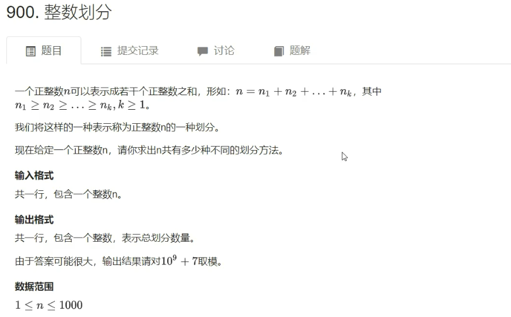

## 计数类DP

### 1. 整数划分

- 题目



```
输入
5
输出
7
```

- 样例解释

>5 = 5
>
>​	= 4 + 1
>
>​	= 3 + 2
>
>​	= 3 + 1 + 1
>
>​	= 2 + 2 + 1
>
>​	= 2 + 1 + 1 + 1
>
>​	= 1 + 1 + 1 + 1 + 1

- **解法1**

可以看作是一个**完全背包问题**，背包容量是N，且有N个物品，物品的体积分别是1,2,3,…,N，求恰好装满背包的方案数。每种物品可以用无限次。

（不考虑顺序：即1，2，1和2，1，1是同一种方案。）

1. 状态表示f[i,j]
   1. 集合：所有从1~i当中选，且总体积恰好是j的选法
   2. 属性：Count
2. 状态计算 —— 集合划分

以第i个物品选的个数来划分：

选0个：$f[i-1,j]$

选1个：$f[i-1,j-i]$

选2个：$f[i-1,j-2i]$

假设最多选$s$个：$f[i-1,j-si]$

- 时间复杂度分析：

$状态数量O(n^2)\times 转移计算量O(n) = O(n^3)$

但也不是$O(n^3)$，更准确点来说时间复杂度应该是 $O(n^2\log n)$ （用到了调和级数）

这种做法是可以过的，但是这道题还是可以优化的。

- 优化思路

$$
f[i,j]=f[i-1,j]+f[i-1,j-i]+f[i-1,j-2i]+\cdots+f[i-1,j-si]\\
f[i,j-i]=f[i-1,j-i]+f[i-1,j-2i]+f[i-1,j-3i]+\cdots+f[i-1,j-si]\\
\therefore f[i,j] = f[i-1,j]+f[i,j-i]
$$

所以，这道题最终的状态转移方程为 ==$f[i,j] = f[i-1,j]+f[i,j-i]$==

滚动数组优化：$f[j] = f[j]+f[j-i]$（体积从小到大枚举）

- 代码

```c++
#include <iostream> 

using namespace std;

const int N = 1010, MOD = 1e9 + 7;

int n;
int f[N];

int main()
{
	cin >> n;
	f[0] = 1; // 一个数都没有且一个数都不选的方案数是1，f[1~n]则都是0

	for (int i = 1; i <= n; i ++ )
		for (int j = i; j <= n; j ++ )
			f[j] = (f[j] + f[j - i]) % MOD;

	cout << f[n] << endl;

	return 0;
}
```

- **解法2**

1. 状态表示f[i,j]
   1. 集合：所有总和是i，并且恰好表示成j个数的和的方案
   2. 属性：Count
2. 状态计算 —— 集合划分

分成两大类，第一类是：方案中最小值是1（即j个数里面存在最小值1），第二类是：方案中最小值大于1。

① 最小值是1：去掉一个1，即$f[i-1,j-1]$。

② 最小值大于1：每个数都大于1，可以把这里面的每个数都减1，即$f[i-j,j]$。

综上所述：状态转移方程为 ==$f[i,j]=f[i-1,j-1]+f[i-j,j]$==

最后的答案 $ans = f[n,1]+f[n,2]+\cdots+f[n,n]$

- 代码

```c++
#include <iostream>

using namespace std;

const int N = 1010, MOD = 1e9 + 7;

int n;
int f[N][N];

int main()
{
	cin >> n;

	f[0][0] = 1;
	for (int i = 1; i <= n; i ++ )
		for (int j = 1; j <= i; j ++ )
			f[i][j] = (f[i - 1][j - 1] + f[i - j][j]) % MOD;

	int res = 0;
	for (int i = 1; i <= n; i ++ ) res = (res + f[n][i]) % MOD;

	cout << res << endl;

	return 0;
}
```

****

## 数位统计DP

### 1. 计数问题

- 题目


```
输入
1 10
44 497
346 542
1199 1748
1496 1403
1004 503
1714 190
1317 854
1976 494
1001 1960
0 0
输出
1 2 1 1 1 1 1 1 1 1
85 185 185 185 190 96 96 96 95 93
40 40 40 93 136 82 40 40 40 40
115 666 215 215 214 205 205 154 105 106
16 113 19 20 114 20 20 19 19 16
107 105 100 101 101 197 200 200 200 200
413 1133 503 503 503 502 502 417 402 412
196 512 186 104 87 93 97 97 142 196
398 1375 398 398 405 499 499 495 488 471
294 1256 296 296 296 296 287 286 286 247
```

- 思路

该做法中最重要的一步：==分情况讨论！==

目标[a,b]中统计0~9出现的次数。

实现函数int count(n, x)，功能是求出来从1~n中x出现的次数。

那么count(b, x) - count(a - 1, x)就是从a到b当中x出现的次数。（前缀和思想）
$$
n = abcdefg\\
分别求出1在每一位上出现的次数\\

例如：求x在第4位（d）上出现的次数\\
n=abcdefg\\
1. 当x>0时，有\\
(1) 前三位：000\sim abc-1，后三位：000\sim 999。方案数：abc\times 1000\\
(2) 前三位取abc时，\\
\qquad (2.1)当d<x时，无解。方案数：0\\
\qquad (2.2)当d=x时，后三位：000\sim efg。方案数：efg+1\\
\qquad (2.3)当d>x时，后三位：000\sim 999，方案数：1000\\
2. 当x=0时，有\\
(1) 前三位：001\sim abc-1，后三位：000\sim 999。方案数：abc\times 1000\\
其余情况与x>0时相同。
$$

- 代码

```c++
#include <iostream>
#include <cstring>
#include <algorithm>
#include <vector>
using namespace std;

/*

001~abc-1, 999

abc
    1. num[i] < x, 0
    2. num[i] == x, 0~efg
    3. num[i] > x, 0~999

*/

int get(vector<int> num, int l, int r) // 因为我们举的分类中，有需要求出一串数字中某个区间的数字，例如abcdefg有一个分类需要求出efg+1
{
    int res = 0;
    for (int i = l; i >= r; i -- ) res = res * 10 + num[i]; // 这里从小到大枚举是因为下面count的时候读入数据是从最低位读到最高位，那么此时在num里，最高位存的就是数字的最低位，那么假如我们要求efg，那就是从2算到0
    return res;
}

int power10(int i) // 这里有power10是因为有一个分类需要求得十次方的值，例如abc*10^3
{
    int res = 1;
    while (i -- ) res *= 10;
    return res;
}

// 统计1~n中x出现的次数
int count(int n, int x)
{
    if (!n) return 0;
    vector<int> num; // num用来存储数中每一位的数字
    while (n)
    {
        num.push_back(n % 10); // get里有解释
        n /= 10;
    }
    n = num.size(); // 得出他的长度
    int res = 0;
    for (int i = n - 1 - !x; i >= 0; i -- ) // 这里需要注意，我们的长度需要减一，是因为num是从0开始存储，而长度是元素的个数，因此需要减1才能读到正确的数值，而！x出现的原因是因为我们不能让前导零出现，如果此时需要我们列举的是0出现的次数，那么我们自然不能让他出现在第一位，而是从第二位开始枚举
	{
        if (i < n - 1) // 其实这里可以不用if判断，因为for里面实际上就已经达成了if的判断，但为了方便理解还是加上if来理解，这里i要小于n-1的原因是因为我们不能越界只有7位数就最高从七位数开始读起
        {
            res += get(num, n - 1, i + 1) * power10(i); // 这里就是第一个分类，000~abc-1,那么此时情况个数就会是abc*10^3，这里的3取决于后面efg的长度，假如他是efgh，那么就是4
            // 这里的n-1，i-1，自己将数组列出来然后根据分类标准就可以得出为什么l是n-1，r是i-1
            if (!x) res -= power10(i); // 假如此时我们要列举的是0出现的次数，因为不能出现前导零，这样是不合法也不符合我们的分类情况，例如abcdefg我们列举d，那么他就得从001~abc-1，这样就不会直接到efg，而是会到0efg，因为前面不是前导零，自然就可以列举这个时候0出现的次数，所以要减掉1个power10
        }
        // 剩下的这两个就直接根据分类标准来就好了
        if (num[i] == x) res += get(num, i - 1, 0) + 1;
        else if (num[i] > x) res += power10(i);
    }
    return res; // 返回res，即出现次数
}

int main()
{
    int a, b;
    while (cin >> a >> b, a || b) // 读入数据，无论a，b谁是0，都是终止输入，因为不会有数字从零开始（a，b>0）
    {
        if (a > b) swap(a, b); // 因为我们需要从小到大，因此如果a大于b，那么就得交换，使得a小于b
        for (int i = 0; i <= 9; i ++ ) // 统计a和b之间的所有数字中 0∼9的出现次数
        	cout << count(b, i) - count(a - 1, i) << ' '; // 这里有点类似前缀和，要求a和b之间，那么就先求0到a i出现的次数，再求0到b i出现的次数，最后再相减就可以得出a和b之间i出现的次数
        cout << endl;
    }
    
    return 0;
}
```


****

## 状态压缩DP

### 1. 蒙德里安的梦想

- 题目


``` 
输入
1 2
1 3
1 4
2 2
2 3
2 4
2 11
4 11
0 0
输出
1
0
1
2
3
5
144
51205
```

- 思路


i代表当前枚举到第i列，j是一个二进制数，表示当前列的第j的每个二进制位的那一行是否被占据，是的话该位就是1，否则就是0。

简单点来说，j表示上一列第i-1列伸到第i列的位置。特殊情况：当i==0时，j=00000。


- 代码

```c++
#include <iostream>
#include <algorithm>

using namespace std;

typedef long long LL;

const int N = 12, M = 1 << N;

int n, m;
LL f[N][M];
bool st[M];

int main()
{
	cin >> n >> m;
	while (cin >> n >> m, n || m)
	{
		memset(f, 0, sizeof f);

		for (int i = 0; i < 1 << n; i ++ )
		{
			st[i] = true;
			int cnt = 0; // 表示当前这段连续0的个数
			for (int j = 0; j < n; j ++ )
				if (i >> j & 1)
				{
					if (cnt & 1) st[i] = false; // 判断上一段是否是奇数个，是的话说明第i个状态不合法，
					cnt = 0; // 重置cnt
				}
				else cnt ++ ;

			if (cnt & 1) st[i] = false; // 判断最后一段是否合法
		}

		f[0][0] = 1;
		for (int i = 1; i <= m; i ++ )
			for (int j = 0; j < 1 << n; j ++ )
				for (int k = 0; k < 1 << n; k ++ )
					if ((j & k) == 0 && st[j | k])
						f[i][j] += f[i - 1][k];

		cout << f[m][0] << endl; // 在第m列且没有任何方格伸出来就是答案。
	}

	return 0;
}
```

****

### 2. 最短Hamilton路径

- 题目


```
输入
5
0 2 4 5 1
2 0 6 5 3
4 6 0 8 3
5 5 8 0 5
1 3 3 5 0
输出
18
```

- 思路

1. 状态表示f[i,j]
   1. 集合：从0走到j，走过的所有点是i的所有路径（因为i表示的是一个状态，且这道题$1\le n\le 20$，所以可以把i看作是一个二进制数，1表示走过，0表示没走过）
   2. 属性：Min
2. 状态计算 —— 集合划分

**以倒数第二个点来分类**，倒数第二个点可以是：0，1，2，……，n-1。

倒数第二个点是k：$0 \rightarrow k \rightarrow j$，其中$k\rightarrow j$是已知的，那么目标就是让$0\rightarrow k$的距离最短，即 $f[i-\{j\}, k] + w[k,j]$

所以，$f[i,j]=Min(\{f[i-\{j\},k]+w[k,j]\})$

- 代码

```c++
#include <iostream>
#include <algorithm>
#include <cstring>

using namespace std;

const int N = 20, M = 1 << N;

int n;
int w[N][N];
int f[M][N];

int main()
{
	cin >> n;
	for (int i = 0; i < n; i ++ )
		for (int j = 0; j < n; j ++ )
			cin >> w[i][j];

	memset(f, 0x3f, sizeof f);
	f[1][0] = 0; // 起点的最短路径是0
	for (int i = 0; i < 1 << n; i ++ )
		for (int j = 0; j < n; j ++ )
			if (i >> j & 1)
				for (int k = 0; k < n; k ++ )
					if ((i - (1 << j)) >> k & 1)
						f[i][j] = min(f[i][j], f[i - (1 << j)][k] + w[k][j]);

	cout << f[(1 << n) - 1][n - 1] << endl;

	return 0;
}
```


****


## 树形DP

### 1. 没有上司的舞会


```
输入
7
1
1
1
1
1
1
1
1 3
2 3
6 4
7 4
4 5
3 5
0 0
输出
5
```

- 思路

1. 状态表示 f[u,0]和f[u,1]

   1. 集合：**f[u,0]表示所有从以u为根的子树中选择，并且不选u这个点的方案；**

      **同理，f[u,1]表示所有从以u为根的子树中选择，并且选择u这个点的方案。**

   2. 属性：Max

2. 状态计算 —— 集合划分

f[u,0]的选法：

f[u,1]的选法：f[u,1] = 所有子节点选择的和

所以，状态转移方程为：

- 时间复杂度分析

$状态量O(n-1) \times 转移计算量O(1) = O(n)$

- 代码

```c++
#include <iostream>
#include <algorithm>
#include <cstring>

using namespace std;

const int N = 6010;

int n;
int happy[N];
int h[N], e[N], ne[N], idx;
int f[N][2];
bool has_father[N];

void add(int a, int b)
{
	e[idx] = b, ne[idx] = h[a], h[a] = idx ++ ;
}

void dfs(int u)
{
	f[u][1] = happy[u];

	for (int i = h[u]; i != -1; i = ne[i])
	{
		int j = e[i];
		dfs(j);
		// 状态转移方程
		f[u][0] += max(f[j][0], f[j][1]);
		f[u][1] += f[j][0];
	}
}

int main()
{
	cin >> n;
	for (int i = 1; i <= n; i ++ ) cin >> happy[i];

	memset(h, -1, sizeof h);
	for (int i = 0; i < n - 1; i ++ )
	{
		int a, b;
		cin >> a >> b;
		has_father[a] = true;
		add(b, a);
	}

	int root = 1;
	while (has_father[root]) root ++ ;

	dfs(root);

	cout << max(f[root][0], f[root][1]) << endl;

	return 0;
}
```


****

## 记忆化搜索

### 1. 滑雪


```
输入
5 5
1 2 3 4 5
16 17 18 19 6
15 24 25 20 7
14 23 22 21 8
13 12 11 10 9
输出
25
```

- 思路

1. 状态表示f[i,j]
   1. 集合：**所有从(i, j)开始滑的路径**
   2. 属性：Max
2. 状态计算 —— 集合划分

以向哪个方向滑来进行分类，总共有4类：上、下、左、右。

右：向右滑，先求出向右滑之后的最大值，然后+1即可，f[i,j+1]+1；同理可得其他3类。需要注意的是，不能越界。

整个计算过程中有一个前提就是这个图必须是拓扑图，不能存在环。

这张图明显不可能存在环，因为是递减的。

- ==记忆化搜索的好处：==**代码复杂度低，思路简单，容易调试。**
- ==记忆化搜索的缺点：==**运行时间比循环稍微慢一些，递归层数多可能会暴栈。**

- 代码

```c++
#include <iostream>
#include <algorithm>

using namespace std;

const int N = 310;

int n, m;
int h[N][N];
int f[N][N];

int dir[4][2] = {1, 0, -1, 0, 0, 1, 0, -1};

int dp(int x, int y)
{
	int& v = f[x][y];
	if (v != -1) return v; // 计算过了，直接返回

	v = 1; // 初始化v为1，至少可以走当前格子
	for (int i = 0; i < 4; i ++ )
	{
		int a = x + dir[i][0], b = y + dir[i][1];
		if (a >= 1 && a <= n && b >= 1 && b <= m && h[a][b] < h[x][y])
			v = max(v, dp(a, b) + 1);
	}

	return v;
}

int main()
{
	cin >> n >> m;
	for (int i = 1; i <= n; i ++ )
		for (int j = 1; j <= m; j ++ )
			cin >> h[i][j];

	memset(f, -1, sizeof f);

	int res = 0;
	for (int i = 1; i <= n; i ++ )
		for (int j = 1; j <= m; j ++ )
			res = max(res, dp(i, j));

	cout << res << endl;

	return 0;
}
```

