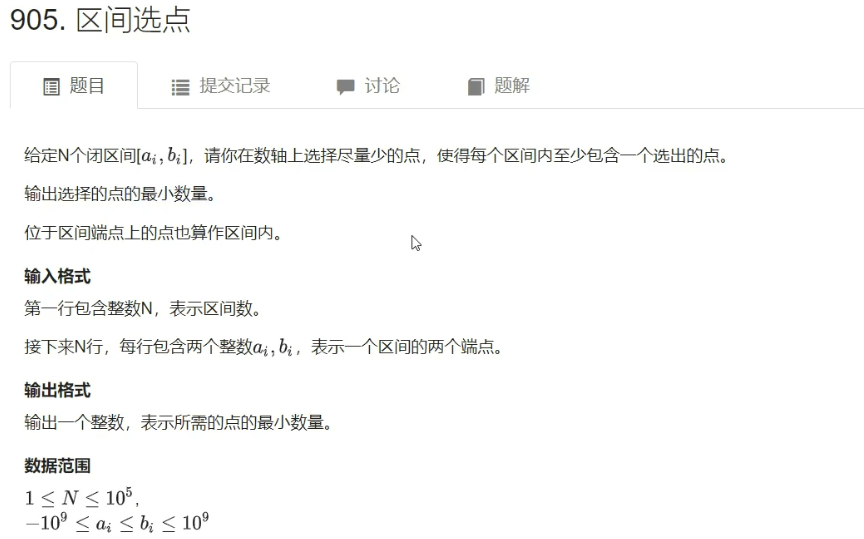

# 贪心算法

### 1. 区间选点



```
输入
3
-1 1
2 4
3 5
输出
2
```

- 思路


- 代码

```c++
#include <iostream>
#include <algorithm>

using namespace std;

typedef pair<int, int> PII;

const int N = 100010;

int n;
PII range[N];

int main()
{
	cin >> n;
	for (int i = 0; i < n; i ++ ) cin >> range[i].first >> range[i].second;

	sort(range, range + n, [](const PII& a, const PII& b){ return a.second < b.second; });

	int res = 0, ed = -2e9; // ed表示上一个点的下标，初始化为负无穷
	for (int i = 0; i < n; i ++ )
		if (range[i].first > ed)
		{
			res ++ ;
			ed = range[i].second;
		}

	cout << res << endl;

	return 0;
}
```

****

### 2. 最大不相交区间数量


```
输入
3
-1 1
2 4
3 5
输出
2
```

- 思路

思路与上一题一模一样，代码也一样。

- 代码

```c++
#include <iostream>
#include <algorithm>

using namespace std;

typedef pair<int, int> PII;

const int N = 100010;

int n;
PII range[N];

int main()
{
	cin >> n;
	for (int i = 0; i < n; i ++ ) cin >> range[i].first >> range[i].second;

	sort(range, range + n, [](const PII& a, const PII& b){ return a.second < b.second; });

	int res = 0, ed = -2e9; // ed表示上一个点的下标，初始化为负无穷
	for (int i = 0; i < n; i ++ )
		if (range[i].first > ed)
		{
			res ++ ;
			ed = range[i].second;
		}

	cout << res << endl;

	return 0;
}
```

****

### 3. 区间分组


```
输入
3
-1 1
2 4
3 5
输出
2
```

- 思路


- 代码

```c++
#include <iostream>
#include <algorithm>
#include <queue>

using namespace std;

typedef pair<int, int> PII;

const int N = 100010;

int n;
struct Range
{
	int l, r;
	bool operator<(const Range& rhs)
	{
		return l < rhs.l;
	}
}range[N];


int main()
{
	cin >> n;
	for (int i = 0; i < n; i ++ )
	{
		int l, r;
		cin >> l >> r;
		range[i] = {l, r};
	}

	sort(range, range + n);

	// 用小根堆来维护所有区间的右端点的最大值
	priority_queue<int, vector<int>, greater<int>> heap;
	for (int i = 0; i < n; i ++ )
	{
		auto r = range[i];
		if (heap.empty() || heap.top() >= r.l) heap.push(r.r);
		else
		{
			int t = heap.top();
			heap.pop();
			heap.push(r.r);
		}
	}

	cout << heap.size() << endl;

	return 0;
}
```

****

### 4. 区间覆盖


```
输入
1 5
3
-1 3
2 4
3 5
输出
2
```

- 思路


- 代码

```c++
#include <iostream>
#include <algorithm>

using namespace std;

const int N = 100010;

int n;
struct Range
{
	int l, r;
	bool operator<(const Range& rhs) { return l < rhs.l; }
}range[N];

int main()
{
	int st, ed;
	cin >> st >> ed >> n;
	for (int i = 0; i < n; i ++ )
	{
		int l, r;
		cin >> l >> r;
		range[i] = {l, r};
	}

	sort(range, range + n);

	int res = 0;
	bool success = false;
	for (int i = 0; i < n; i ++ )
	{
		int j = i, r = -2e9;
		while (j < n && range[j].l <= st)
		{
			 r = max(r, range[j].r);
			 j ++ ;
		}

		if (r < st)
		{
			res = -1;
			break;
		}

		res ++ ;
		if (r >= ed)
		{
			success = true;
			break;
		}

		st = r;
		i = j - 1;
	}

	if (!success) res = -1;
	cout << res << endl;

	return 0;
}
```

****


### 5. 合并果子


```
输入
3
1 2 9
输出
15
```

- 思路

**经典哈夫曼问题**


**整个结果中叶子节点$p$被计算的次数是叶子节点$p$到根节点的路径长度。**

贪心策略：==每次挑出最小的两堆进行合并==。这也是**构造哈夫曼树**的方法。

- 证明

1. **最小的两个点，深度一定最深，且可以互为兄弟。**

反证法：

**最小的两个点，深度一定最深**：假设最小的两个点并不是深度最深的

如图，如果节点f比b还要小，那么交换f和b一定会使得结果变得更小。

**且可以互为兄弟**：因为a，b，c，d都处于同一层（所以到达根节点的距离一样），所以他们都可以互为各自的兄弟，因为顺序怎么交换结果都一样。

2. **构造哈夫曼树的证明**


- 代码

```c++
#include <iostream>
#include <algorithm>
#include <queue>
#include <vector>

using namespace std;

int main()
{
	int n;
	cin >> n;

	priority_queue<int, vector<int>, greater<int>> heap; // 小根堆
	while (n -- )
	{
		int x;
		cin >> x;
		heap.push(x);
	}

	int res = 0;
	while (heap.size() > 1) // 当至少存在两个点时就合并
	{
		int a = heap.top(); heap.pop(); // 每次取出来最小的两个值
		int b = heap.top(); heap.pop();
		res += a + b; // 更新res
		heap.push(a + b); // 然后把他们的和插入堆中
	}

	cout << res << endl;

	return 0;
}
```

****

### 6. 排队打水


```
输入
7
3 6 1 4 2 5 7
输出
56
```

- 思路


- 代码

```c++
#include <iostream>
#include <algorithm>

using namespace std;

typedef long long LL;

const int N = 100010;

int n;
int a[N];

int main()
{
	cin >> n;
	for (int i = 0; i < n; i ++ ) cin >> a[i];
	sort(a, a + n);

	LL res = 0;
	for (int i = 0; i < n; i ++ ) res += a[i] * (n - i - 1);
	cout << res << endl;

	return 0;
}
```

****

### 6. [货仓选址](https://www.acwing.com/problem/content/106/)


- 思路


- 代码

```c++
#include <iostream>
#include <cstring>
#include <algorithm>

using namespace std;

typedef long long LL;

const int N = 100010;

int n;
int a[N];

int main()
{
    cin >> n;
    for (int i = 0; i < n; i ++ ) cin >> a[i];
    
    sort(a, a + n);
    
    int c = a[n / 2]; // 找到中点位置
    
    LL res = 0;
    for (int i = 0; i < n; i ++ ) res += abs(a[i] - c);
    
    cout << res << endl;
    
    return 0;
}
```

****

### 7. 耍杂技的牛


```
输入
3
10 3
2 5
3 3
输出
2
```

- 思路

直接给出结论：**按照$w_i+s_i$从小到大的顺序排，结果一定是最优的。**

- 证明

贪心一般证明的两个方向：

1. 贪心得到的答案 $\ge$ 最优解
2. 贪心得到的答案 $\le$ 最优解

结合1和2就可以证明出：贪心得到的答案一定是最优解。

第1点很好证明，最优解是所有解中的最小值，而贪心得到的答案是所有方案中的一种 ，因此最优解一定小于等于贪心解

第2点：如果不是按照$w_i+s_i$从小到大排序的，那么他就一定存在相邻两头牛使得$w_i+s_i>w_{i+1}+s_{i+1}$。

此时，交换第i头牛和第i+1头牛不会影响到其它牛的总和，因此只要看这两头牛即可。


​																																				$\Downarrow$


​																																				$\Downarrow$


交换后的结果和交换前的结果相比，一定相同或更优。因此证得 贪心得到的答案 $\le$ 最优解。

- 代码

```c++
#include <iostream>
#include <algorithm>

using namespace std;

typedef pair<int, int> PII;

const int N = 50010;

int n;
PII cow[N];

int main()
{
	cin >> n;
	for (int i = 0; i < n; i ++ ) cin >> cow[i].first >> cow[i].second;
	sort(cow, cow + n, [](const PII& a, const PII& b) { return a.first + a.second < b.first + b.second; });

	int res = -2e9, sum = 0;
	for (int i = 0; i < n; i ++ )
	{
		int w = cow[i].first, s = cow[i].second;
		res = max(res, sum - s);
		sum += w;
	}

	cout << res << endl;

	return 0;
}
```
