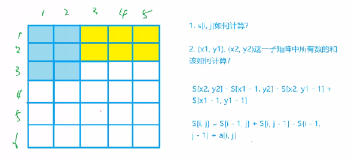

## 高精度算数

给你正整数`a`和`b`，求出`a * b` 或 `a / b` 或 `a + b` 或 `a - b` 的结果。

其中 `1 <= a的长度 <= 1e6`、`1 <= b <= 10000`。

+ 思考

`大整数在C++中是如何存放的呢？`

答案是用**数组**存，将大整数的每一位存到数组里。**并且保证第0位存的是个位。**

### 高精度加法与减法

- 代码

```C++
#include <iostream>
#include <algorithm>
#include <cstring>
#include <vector>

using namespace std;

// 判断是否有 A >= B
bool cmp(const vector<int>& A, const vector<int>& B)
{
    if (A.size() != B.size()) return A.size() > B.size();
    for (int i = A.size() - 1; i >= 0; i -- )
        if(A[i] != B[i])
            return A[i] > B[i];
    return true;
}

// 1. 高精度加法（A和B都可以是大整数）
vector<int> add(vector<int>& A, vector<int>& B)
{
    if (A.size() < B.size()) return add(B, A);
    
    vector<int> C;
    int t = 0; // 进位，初始为0
    for (int i = 0; i < A.size(); i ++ )
    {
        t += A[i];
        if (i < B.size()) t += B[i];
        C.push_back(t % 10);
        t /= 10; // 如果有进位，t=1，否则，t=0
    }
    if (t) C.push_back(t);
    return C;
}

// 2. 高精度减法（A，B都是大整数并且保证 A >= B）
vector<int> sub(vector<int>& A, vector<int>& B)
{
    vector<int> C;
    int t = 0;
    for (int i = 0; i < A.size(); i ++ ) // A.size() >= B.size()
    {
        t = A[i] - t;
        if (i < B.size()) t -= B[i];
        C.push_back((t + 10) % 10); // 一行代码处理了2种情况：够减和不够减
        if (t < 0) t = 1; // 不够减
        else t = 0; // 够减
    }
    while (C.size() > 1 && C.back() == 0) C.pop_back(); // 去掉前导0
    return C;
}

int main()
{
    string a, b; // a = "123456"
    vector<int> A, B;
    
    cin >> a >> b;
    for (int i = a.size() - 1; i >= 0; i -- ) A.push_back(a[i] - '0'); // A = [6, 5, 4, 3, 2, 1]
    for (int i = b.size() - 1; i >= 0; i -- ) B.push_back(b[i] - '0');
    
    // A+B:
    auto C = add(A, B);
    for (int i = C.size() - 1; i >= 0; i -- ) printf("%d", C[i]);
    cout << endl;
    
    // A-B:
    if (cmp(A, B)) // 如果 A >= B，直接计算A-B
    {
        auto C = sub(A, B);
        for (int i = C.size() - 1; i >= 0; i -- ) printf("%d", C[i]);
    }
    else // 否则，计算B-A的值，并在前面加上负号
    {
        auto C = sub(B, A);
        printf("-");
        for (int i = C.size() - 1; i >= 0; i -- ) printf("%d", C[i]);
    }
    
    return 0;
}
```

### 高精度乘法与除法

- 当A**远远大于**B时，才会碰到 A · B  和 A / B 的求解问题。

```C++
#include <iostream>
#include <algorithm>
#include <cstring>
#include <vector>

using namespace std;

// 3.高精度乘法（A为大整数，B为int范围内整数，即 A >> B）
vector<int> mul(vector<int>& A, int B)
{
    vector<int> C;
    int t = 0; // 进位
    for (int i = 0; i < A.size() || t; i ++ )
    {
        if (i < A.size()) t += A[i] * B;
        C.push_back(t % 10);
        t /= 10;
    }
    return C;
}

// 4. 高精度除法（A >> B）,商C余r
vector<int> div(vector<int>& A, int b, int& r)
{
    vector<int> C; // 商
    r = 0; // 余数
    for (int i = A.size() - 1; i >= 0; i -- )
    {
    	r = r * 10 + A[i];
        C.push_back(r / b);
        r %= b;
    }
    reverse(C.begin(), C.end());
    while (C.size() > 1 && C.back() == 0) C.pop_back(); // 去除前导0
    return C;
}

int main()
{
    string a;
    int b;  // b的数据范围远小于A
    cin >> a >> b;
    
    vector<int> A;
    for (int i = a.size() - 1; i >= 0; i -- ) A.push_back(a[i] - '0');
    
    // auto C = mul(A, b);
    
    int r; // A / B 的余数
    auto C = div(A, b, r);
    
    for (int i = C.size() - 1; i >= 0; i -- ) printf("%d", C[i]);
    cout << endl << r << endl;
    
    return 0;
}
```

****

## 前缀和

### 一维前缀和

原数组`a[i]`：$a1, a2, a3, a4, … , ai$

前缀和数组`s[i]`：$S(i) = a1 + a2 + a3 + … + ai$

1. **如何求S(i)？**

```C++
for(int i = 1; i < n; i++)
    s[i] = s[i - 1] + a[i];
```

2. **作用**

能快速求出来原数组中一段数字的和。==时间复杂度为$O(1)$。==

例：求解数组中范围为[l, r]中元素的和

```C++
ans = s[r] - s[l - 1];
```


+ ==细节==：s应该从下标为1开始计算。并且将`s[0]`初始化为0。

将s[0]定义成0的好处：可以处理所有的情况。

例如，求解范围[1, 10]内元素的和。公式`s[r] - s[l - 1]`依然成立。可以统一处理所有情况。这就是为什么下标从1开始存数组，以及为何s[0]初始化为0的原因。

```C++
ans = s[10] - s[0];
```

+ **代码**

```C++
#include <iostream>
#include <cstring>
#include <algorithm>

using namespace std;

const int N = 1e6 + 10;
int n, m;
int a[N], s[N];

int main()
{
    scanf("%d%d", &n, &m);
    for(int i = 1; i <= n; i++) scanf("%d", &a[i]); // 输入数组
    
    for(int i = 1; i <= n; i++) s[i] = s[i - 1] + a[i]; // 前缀和的初始化
    
    while (m--) // 对于m次询问
    {
        int l, r;
        scanf("%d%d", &l, &r);
        printf("%d\n", s[r] - s[l - 1]); // 区间和的计算
    }
}
```

****

### 应用题

#### 1. [K倍区间](https://www.acwing.com/problem/content/1232/)

- 思路：前缀和 + 哈希表

#### 2. [涨姿势题2](http://120.78.128.11/Contest.jsp?cid=1158#P6)

- 思路：前缀和 + 二分

```c++
#include <iostream>
#include <algorithm>

using namespace std;

typedef long long LL;

const int N = 10010;

int n, m;
LL s[N];

int main()
{
	int T;
	cin >> T;
	while (T -- )
	{
		cin >> n >> m;
		for (int i = 1; i <= n; i ++ )
		{
			cin >> s[i];
			s[i] += s[i - 1];
		}
		
		while (m -- )
		{
			LL res = 0, q;
			cin >> q;
			int l = 1, r = 1;
            while (r <= n)
            {
            	LL t = s[r] - s[l - 1];
            	if (t == q) res ++ ;
            	if (t <= q) r ++ ;
            	else l ++ ;
			}
            
			cout << res << endl;
		}
	}
	
	return 0;
}
```

#### 3. [真签到](http://120.78.128.11/Contest.jsp?cid=1158#P61)


****

### 二维前缀和

原数组：`a[i][j]`，二维前缀和数组：`s[i][j]`

```C++
// s[i][j]的递归公式
s[i][j] = s[i - 1][j] + s[i][j - 1] - s[i - 1][j - 1] + a[i][j];
```

- 思路



+ 应用：[子矩阵的和](https://www.acwing.com/problem/content/798/)，即求解以`（x1, y1）`为左上角到`（x2, y2）`为右下角的区域内的元素和。

```C++
ans = s[x2][y2] - s[x2][y1 - 1] - s[x1 - 1][y2] + s[x1 - 1][y1 - 1];
```

+ 代码

```C++
#include <iostream>
using namespace std;

const int N = 1010;

int n, m, q;
int a[N][N], s[N][N];

int main()
{
    scanf("%d%d%d", &n, &m, &q);
    for(int i = 1; i <= n; i++)
        for(int j = 1; j <= m; j++)
			scanf("%d", &a[i][j]);
    
    for(int i = 1; i <= n; i++)
        for(int j = 1; j <= m; j++)
            s[i][j] = s[i - 1][j] + s[i][j - 1] - s[i - 1][j - 1] + a[i][j]; // 求前缀和
    
    while(q--)
    {
        int x1, y1, x2, y2;
        scanf("%d%d%d%d", &x1, &y1, &x2, &y2);
        printf("%d\n", s[x2][y2] - s[x1 - 1][y2] - s[x2][y1 - 1] + s[x1 - 1][y1 - 1]); // 计算子矩阵的和
    }
    
    return 0;
}
```


## 差分

### 一维差分

原数组`a[i]`: $a_1, a_2, a_3, … , a_i$

构造差分数组`b[i]`，使得 $ai = b_1 + b_2 + b_3 + .. + b_i$，即`a`为`b`的前缀和数组。

+ **a数组称为b数组的前缀和，b数组称为a数组的差分。**

==即差分为前缀和的逆运算==。假定a数组初始化全部都是0，那么差分数组b也都是0。

但是数组肯定不是0 ，所以让数组`a`进行一个**插入操作**。第一次让`[1,1]`加上`a[1]`的给定值，第二次让`[2,2]`加上`a[2]`，……，直到让`[n,n]`加上`a[n]`。

+ 应用
  1. 给定一个数组a，让a中 ==[l,r]== 区间内的所有数字都==加上c==。暴力（O(n)），差分（O(1)）

**思路：让b数组在l处加上c，并且在r+1处减去c**，时间复杂度：$O(1)$。

​										|											\\——->作用：让`a[r+1]`以及之后的所有元素减去`c`

作用：让`a[l]`之后的所有元素都加上`c`

- 所以，会导致a数组在`[l,r]`这一段都加上c，并且`[r+1,n]`这一段加c后再减c，抵消了（不变）。

+ [题目](https://www.acwing.com/problem/content/799/)
+ 代码

```C++
#include <iostream>
#include <cstring>

using namespace std;

const int N = 100010;

int n, m;
int a[N], b[N]; // a:原数组，b:差分数组

// 让[l,r]区间加上c【核心操作】
void insert(int l, int r, int c)
{
    b[l] += c;
    b[r + 1] -= c;
}

int main()
{
    scanf("%d%d", &n, &m);
    for(int i = 1; i <= n; i++) scanf("%d", &a[i]);
    
    for(int i = 1; i <= n; i++) insert(i, i, a[i]); // 构造a的差分数组
    
    while (m--)
    {
        int l, r, c;
        scanf("%d%d%d", &l, &r, &c);
        insert(l, r, c);
    }
    
    for(int i = 1; i <= n; i++) b[i] += b[i - 1]; // 求b数组的前缀和，得到修改后的原数组
    
    for(int i = 1; i <= n; i++) printf("%d", b[i]);
    
    return 0;
}
```

****

### 二维差分

类似于一维前缀和与二维前缀和。

```C++
b[x1][y1] += c;
b[x2 + 1][y1] -= c;
b[x1][y2 + 1] -= c;
b[x2 + 1][y2 + 1] += c;
```

+ [题目](https://www.acwing.com/problem/content/800/)

+ 代码

```C++
#include <iostream>

const int N = 1010;

int n, m, q;
int a[N][N], b[N][N];

void insert(int x1, int y1, int x2, int y2, int c)
{
    b[x1][y1] += c;
    b[x2 + 1][y1] -= c;
    b[x1][y2 + 1] -= c;
    b[x2 + 1][y2 + 1] += c;
}

int main()
{
    scanf("%d%d%d", &n, &m, &q);
    for (int i = 1; i <= n; i++)
        for (int j = 1; j <= m; j++)
            scanf("%d", &a[i][j]);
    
    for (int i = 1; i <= n; i++)
        for (int j = 1; j <= m; j++)
            insert(i, j, i, j, a[i][j]);
    
    while (q--)
    {
        int x1, y1, x2, y2, c;
        scanf("%d%d%d%d%d", &x1, &y1, &x2, &y2, &c);
        insert(x1, y1, x2, y2, c);
    }
    
    for (int i = 1; i <= n; i++)
        for (int j = 1; j <= m; j++)
            b[i][j] += b[i - 1][j] + b[i][j - 1] - b[i - 1][j - 1];
    
    for(int i = 1; i <= n; i++)
    {
        for (int j = 1; j <= m; j++) printf("%d ", b[i][j]);
        puts("");
    }       

    return 0;
}
```

****

## 总结

+ 差分与前缀和的关系其实就是类似积分与微分的关系，
+ 差分求导（求前缀和）得到原数组（即差分的前缀和），原数组求导（求前缀和）得到前缀和（即原数组的前缀和）。

## 习题

### 1. [增减序列](https://www.acwing.com/problem/content/102/)

