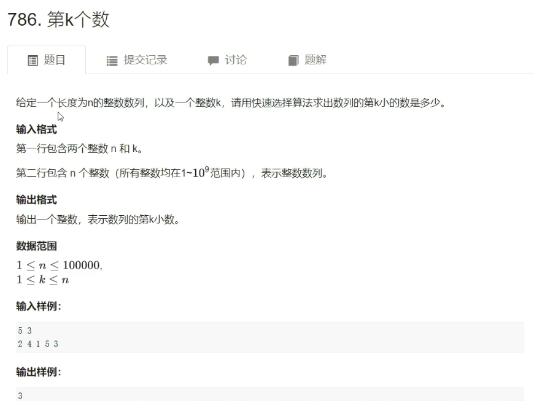

## 第k个数（快速选择算法）



- 思路：利用快排思想，秒了。

- 代码

```C++
#include <iostream>
using namespace std;

const int N = 100010;

int n, k;
int q[N];

int quick_sort(int l, int r, int k)
{
    if(l >= r) return q[l]; // 如果找到了第k个数，返回
	int x = q[l], i = l - 1, j = r + 1;    
    while (i < j)
    {
        while (q[++i] < x);
        while (q[--j] > x);
        if (i < j) swap(q[i], q[j]);
    }
    
    int sl = j - l + 1; // 记录基准数字的左部分有多少个数字
    if (k <= sl) return quick_sort(l, j, k); // 如果第k小的数字在左部分，则递归处理左部分即可
    return quick_sort(j + 1, r, k - sl); // 否则，递归处理右部分，寻找右部分第 k - sl 个数字（即整个数组第k个数）
}

int main()
{
    cin >> n >> k;
    for (int i = 0; i < n; i++) cin >> q[i];
    cout << quick_sort(0, n - 1, k);
    
    return 0;
}
```

****

## 逆序对的数量（归并排序）

- [题目](https://www.acwing.com/problem/content/790/)

+ 思路


+ 代码

```C++
#include <iostream>

using namespace std;

typedef long long LL; // 防止爆int

const int N = 100010;
int n, m;
int q[N], tmp[N];

LL merge_sort(int l, int r)
{
    if(l >= r) return 0;
    int mid = l + r >> 1;
    LL res = merge_sort(l, mid) + merge_sort(mid + 1, r);
	// 归并过程
    int k = 0, i = l, j = mid + 1;
	while(i <= mid && j <= r)
    {
        if(q[i] <= q[j]) tmp[k++] = q[i++];
        else 
        {
            tmp[k++] = q[j++];
    		res += mid - i + 1; // 与归并排序的不同之处
        }
    }
    // 扫尾工作
    while(i <= mid) tmp[k++] = q[i++];
    while(j <= r) tmp[k++] = q[j++];
    // 物归原主
    for(i = l, j = 0; i <= r; i++, j++) q[i] = tmp[j];
    
    return res;
}

int main()
{
    cin >> n;
    for(int i = 0; i < n; i++) cin >> q[i];
    
    cout << merge_sort(0, n - 1) << endl;
    
	return 0;   
}
```

****

## 数的三次方根（浮点数二分）

- [题目](https://www.acwing.com/problem/content/792/)
- 思路：二分秒了。

- 代码

```C++
#include <iostream>

using namespace std;

int main()
{
	double x;
    cin >> x;
    // 范围：-10000 ~ 10000
    double l = -1e4, r = 1e4;
    while(r - l > 1e-8)
    {
        double mid = (l + r) / 2;
        if(mid * mid * mid >= x) r = mid;
        else l = mid;
    }
    printf("%lf\n", l);
    
    return 0;
}
```

****

## 前缀和

- [题目](https://www.acwing.com/problem/content/797/)
- 思路：前缀和模板题，秒了。

- 代码

```C++
#include <iostream>
using namespace std;

const int N = 100010;

int n, m;
int a[N], s[N];

int main()
{
    scanf("%d%d", &n, &m);
    for(int i = 1; i <= n; i++) scanf("%d", &a[i]);
    
    for(int i = 1; i <= n; i++) s[i] = s[i - 1] + a[i];
    
    while (m--)
    {
        int l, r;
        scanf("%d%d", &l, &r);
        printf("%d\n", s[r] - s[l - 1]);
    }
    
    return 0;
}
```

