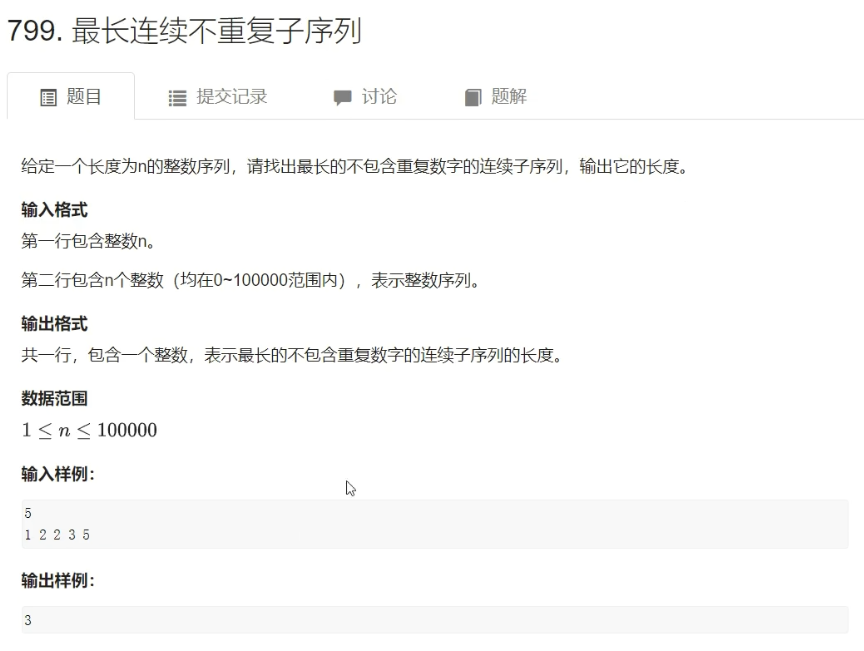

## 双指针算法

**最核心的性质：**==可以优化==

```C++
for(int i = 0; i < n; i++)
    for(int j = 0; j < n; j++)
// 时间复杂度：O(n^2)
        
// 将上面的朴素算法优化到O(n)
```

+ 代码模板

```C++
for(i = 0, j = 0; i < n; i++)
{
    while(j < i && check(i, j)) j++;
    
    // 每道题的具体逻辑
}
```

+ 题目

给定一个字符串，每个单词之间用空格隔开，输出其中的每个单词。（最简单的情况）

> 输入：hello world apple

> 输出：
>
> hello
>
> world
>
> apple

+ 代码

```C++
#include <iostream>

using namespace std;

int main()
{
    char str[1000];
    
    gets(str);
    
    int n = strlen(str);
    
    for(int i = 0; i < n; i++)
    {
        int j = i;
        while(j < n && str[j] != ' ') j++;
        
        // 这道题的具体逻辑
    	for(int k = i; k < j; k++) cout << str[k];
        cout << endl;
        
        i = j;
    }
    
    return 0;
}
```

****

### 1. 最长连续不重复子序列



+ 先想一下暴力怎么做

```C++
// 朴素做法：O(n^2)
for(int i = 0; i < n; i++)
    for(int j = 0; j <= i; j++)
        if(check(j, i))
            res = max(res, i - j + 1);
```

+ 再对暴力进行优化

```C++
// 双指针算法：O(n)
for(int i = 0, j = 0; i < n; i++)
{	// j的含义：以i为右端点，j（左端点）往左最远能到什么地方。
    while(j <= i && check(j, i)) j++; // check(j, i)：检查[j,i]区间是否有重复元素，有的话j++
    res = max(res, i - j + 1);
}
```

+ 代码

```C++
#include <iostream>

using namespace std;

const int N = 100010;

int n;
int a[N];
int s[N]; // s[i]: 当前a[i]中每个数出现的次数

int main()
{
    cin >> n;
    for (int i = 0; i < n; i++) cin >> a[i];
    
    int res = 0;
    for (int i = 0, j = 0; i < n; i++)
    {
        s[a[i]] ++ ;
        // j <= i 在这题中可以不写
        while (s[a[i]] > 1) // 此时说明出现了重复数字，即a[i]。那么就要更新j了
        {
            s[a[j]] -- ; // 剔除j所指向的元素
           	j ++ ; // j指针右移。因为一定不会出现j > i的情况，所以这题while判断中不用写j <= i
        }
        res = max(res, i - j + 1);
    }
    
    cout << res << endl;
    
    return 0;
}
```

****

## 位运算

1. `n`的二进制表示中第`k`位数是几？（从个位开始算起）例如：$n = 15 = (1111)_2$

+ 先把第`k`位移到最后一位（右移）：`n >> k`
+ 判断最后一位是否是1：`x & 1`

```C++
n >> k & 1; // 判断n的二进制表示中第k位数是0还是1

int n = 10;
for (int k = 3; k >= 0; k--) cout << (n >> k & 1);  // 输出：1010
```

2. `lowbit`操作（**树状数组的一个基本操作**）

`lowbit(x) = x & -x`：返回$x$的最后一位1

- 原理


+ 应用：**统计x的二进制表示中1的个数**

### 1. 二进制中1的个数


+ 代码

```C++
#include <iostream>

using namespace std;

int lowbit(x)
{
    return x & -x;
}

int main()
{
    int n;
    cin >> n;
    while (n--)
    {
        int x;
        cin >> x;
        
        int res = 0;
        while(x) x -= lowbit(x), res++; // 每次减去x的最后一位1
        
        cout << res << ' ';
    }
}
```

- 类似题目：[二进制中1的个数](https://www.acwing.com/problem/content/25/)

****

## 离散化

- 特指**整数离散化**

- **值域广（$0 \sim 10^9$），个数少（$10^5$）**


将**有序数组**中的值映射到从0开始的下标，称为离散化。

+ 问题1：`a`数组中可能有重复元素，需要==去重==。

+ 问题2：如何算出`x`离散化后的值。（==二分==）

### 1. [区间和]()


+ 代码

```C++
#include <iostream>
#include <vector>
#include <algorithm>

using namespace std;

typedef pair<int, int> PII;

const int N = 300010;

int n, m;
int a[N], s[N];

vector<int> alls; // 存放用得到的坐标
vector<PII> add, query; // 存放添加和询问

// 寻找x离散化后的值下标
int find(int x)
{
    // C++自带的二分算法
    // return lower_bound(alls.begin(), alls.end(), x) - alls.begin() + 1;
    
    int l = 0, r = alls.size() - 1;
    while (l < r)
    {
        int mid = l + r >> 1;
        if(alls[mid] >= x) r = mid;
        else l = mid + 1;
    }
    return r + 1; // a从1开始映射，便于后边求a的前缀和
}

// c++中的unique函数的一种实现方式（Java，python等程序员可以参考）
/vector<int>::iterator unique(vector<int>& a)
{
    for (int i = 0, j = 0; i < a.size(); i++)
        if (!i || a[i] != a[i - 1])
            a[j++] = a[i];
 	// a[0] ~ a[j - 1] 为所有a中不重复的数
    return a.begin() + j;
}*/

int main()
{
    cin >> n >> m;
    for (int i = 0; i < n; i++)
    {
        int x, c;
        cin >> x >> c;
        add.push_back({x, c});
        
        alls.push_back(x);
    }
    
    for (int i = 0; i < m; i++)
    {
        int l, r;
        cin >> l >> r;
        query.push_back({l, r});
        
        alls.push_back(l);
        alls.push_back(r);
    }
    
    // 排序 + 去重
    sort(alls.begin(), alls.end());
    alls.erase(unique(alls.begin(), alls.end()), alls.end());
    
    // 处理插入
    for (auto item : add)
    {
        int x = find(item.first); // 求出item.first在alls中的下标（离散化后的值）
        a[x] += item.second; //  在离散化后的坐标上加上item.second
    }
    
    // 预处理前缀和
    for (int i = 1; i <= alls.size(); i++) s[i] = s[i - 1] + a[i];
    
    // 处理询问
    for (auto item : query)
    {
        int l = find(item.first), r = find(item.second); // 找到item左右坐标离散化后的下标
        cout << s[r] - s[l - 1] << endl;
    }
    
    return 0;
}
```

****

## 区间合并

### 1. 区间合并


+ 快速合并区间

1. 按区间左端点排序
2. 扫描一遍，维护每一个区间


+ 代码

```C++
#include <iostream>
#include <algorithm>
#include <cstring>
#include <vector>

using namespace std;

typedef pair<int, int> PII;

const int N = 100010;

int n;
vector<PII> segs;

void merge(vector<PII> segs)
{
    vector<PII> res;
    // 排序：pair在C++中先以左端点排序再以右端点排序
    sort(segs.begin(), segs.end());
    
    int st = -2e9, ed = -2e9;
    for (auto seg : segs)
        if (ed < seg.first) // 如果维护的区间的右端点比当前遍历到的左端点还小。说明找到一个区间了，收集结果。
        {
            if (st != -2e9) res.push_back({st, ed}); // 当st更新后才进行收获结果
			st = seg.first, ed = seg.second; // 更新st，ed为当前遍历到的区间的左端点，右端点
        }
        else ed = max(ed, seg.second); // 否则，说明可以合并区间，此时右端点取最大值
    
    // 如果st没被更新，说明输入为空，此时不收获结果
    if (st != -2e9) res.push_back({st, ed});
    
    // 将segs更新成res
    segs = res;
}

int main()
{
    cin >> n;
    for (int i = 0; i < n; i++)
    {
        int l, r;
        cin >> l >> r;
        segs.push_back({l, r});
    }
    
    merge(segs); // 合并区间
    
    cout << segs.size() << endl;
    
    return 0;
}
```

