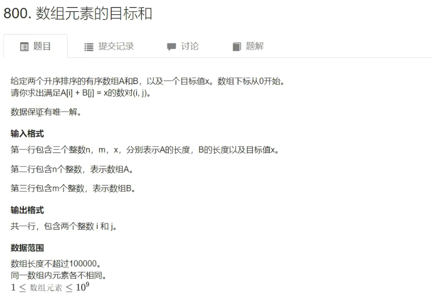

## 数组元素的目标和

+ 题目



+ 输入

```
4 5 6
1 2 4 7
3 4 6 8 9
```

+ 输出

```
1 1
```

+ 暴力解法

```C++
// 暴力：O(n*m)
for(int i = 0; i < n; i++)
    for(int j = 0; j < m; j++)
        if(a[i] + b[j] == x)
            // 输出答案
```

+ 双指针优化（优化的前提：==数据保证只有一组解==，否则不能优化）

```C++
// 双指针：O(n)
for(int i = 0, j = m - 1; i < n; i ++ )
{
	while (j >= 0 && a[i] + b[i] > x) j -- ;
    if(a[i] + b[j] == x)
    	// 输出答案
}
```

+ 代码

```C++
#include <iostream>
#include <algorithm>

using namespace std;

#define IOS ios::sync_with_stdio(false);\
cin.tie(nullptr);\
cout.tie(nullptr);

const int N = 100010;

int n, m, x;
int a[N], b[N];

int main()
{
    IOS
    
    cin >> n >> m >> x;
    for(int i = 0; i < n; i++) cin >> a[i];
    for(int i = 0; i < m; i++) cin >> b[i];
    
    for(int i = 0, j = m - 1; i < n; i++)
    {
        while (j >= 0 && a[i] + b[i] > x) j--;
        if(a[i] + b[j] == x)
        {
            cout << i << j << '\n';
    		break; // 因为题目保证只有一组解，所以可以直接break了
        }
    }
}
```

****

## 循环链表

+ 用的最多的是==循环双链表==。

> 循环单链表用的比较少，循环双链表不是单独拿出来考，而是一道题中需要用到**循环双链表**来做优化。

### 双链表

- 题目


+ 输入

```
10
R 7
D 1
L 3
IL 2 10
D 3
IL 2 7
L 8
R 9
IL 4 7
IR 2 2
```

+ 输出

```
8 7 7 3 2 9
```

+ 代码

```C++
#include <iostream>

using namespace std;

const int N = 100010;

int e[N], l[N], r[N], idx;
// 0表示左端点，1表示右端点

// 初始化
void init()
{
    r[0] = 1, l[1] = 0;
    idx = 2;
}

// 在第k个添加的节点后面添加一个新节点
void add(int k, int x)
{
    e[idx] = x;
    r[idx] = r[k];
    l[idx] = k;
    l[r[k]] = idx;
    r[k] = idx;
    idx++;
}

// 删除第k个添加的节点
void remove(int k)
{
    r[l[k]] = r[k];
    l[r[k]] = l[k];
}

int main()
{
    int m;
    cin >> m;
    
    init();
    
    while (m--)
    {
        string op;
        int k, x;
        cin >> op; // cin对字符输入会自动过滤掉空格和回车，而scanf不行
        
        if (op == "L")
        {
            cin >> x;
            add(0, x);
        }
        else if (op == "R")
        {
            cin >> x;
            add(l[1], x);
        }
        else if (op == "D")
        {
            cin >> k;
            remove(k + 1); // +1的原因是idx从2开始
        }
        else if (op == "IL")
        {
            cin >> k >> x;
            add(l[k + 1], x);
        }
        else
        {
            cin >> k >> x;
            add(k + 1, x);
        }
    }
    
    for(int i = r[0]; i != 1; i = r[i]) cout << e[i] << ' ';
    cout << endl;
    
    return 0;
}
```

