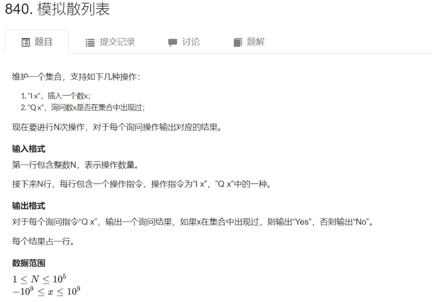
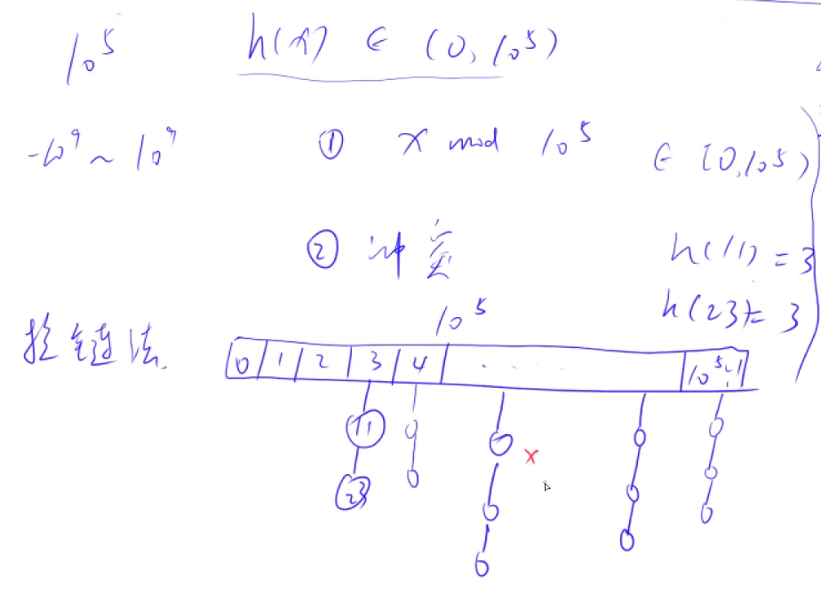

## 哈希表

### 数字哈希

哈希表的作用：把一个比较庞大的空间/值域映射到从0~n（n一般比较小：10^5^或10^6^）

应用场景：将一个数（10^-9^ ~ 10^9^）插入到数组中，每次查询一个数字是否出现过（询问次数不超过10^5^）。

方法：通过一个哈希函数h(x)(10^-9^<= x <= 10^9^) 将这些书映射到0 ~ 10^5^。

问题1：哈希函数怎么写？这里是 x mod 10^5^，一般情况下都是**取模操作**（求模的那个数一般要取成一个==质数==，而且要离2的整次幂尽可能的远【数学证明，可以自己去搜一下】）。

问题2：冲突：两个不一样的数映射成同一个数。

此时我们就应该处理冲突，按照冲突的处理方式，我们可以把它分成两种：开放寻址法和拉链法

离散化是一种极其特殊的哈希方式（之前那个离散化是保序的）。

#### 1. [模拟散列表]()



+ 输入

```
5
I 1
I 2
I 3
Q 2
Q 5
```

+ 输出

```
Yes
No
```

+ **存储结构 **

1. ==开放寻址法==

开一个数组，长度为题目给的输入值最大值的`2~3`倍。

+ 如何处理冲突？

  根据哈希函数得到`k`（`h(x) = k`），如果`k`上有人，那么顺延到下一个位置。

 删除就是查找`x`，找到了就在`x`上打一个标记， 而不是真正的从数组中删掉。

+ 代码

```C++
#include <iostream>

using namespace std;

// 开2倍，并且大于200000的最小质数
const int N = 200003, null = 0x3f3f3f3f; // 约定一个在输入规模外的数用来表示这个位置上没有人。这个数肯定大于10^9

int h[N];

// 如果x在哈希表中存在，返回的就是它所在的位置；否则，返回它应该存储的位置。
int find(int x)
{
    int k = (x % N + N) % N;
    while (h[k] != null && h[k] != x)
    {
        k ++ ;
        if (k == N) k = 0;
    }
    return k;
}

int main()
{
    // 寻找大于200000且最小的质数
    /*for (int i = 200000; ; i ++ )
    {
        for (int j = 2; j * j <= i; j ++ )
            if (i % j == 0)
            {
                flag = false;
                break;
            }
        if (flag)
        {
            cout << i << endl;
            break;
        } 
    }*/
    
    int n;
    scanf("%d", &n);
    
    memset(h, 0x3f, sizeof h); // memset是按字节的，输入一个0x3f，但是它是int型的有4个字节，所以输入0x3f相当于输入了4个0x3f。
    
    while (n -- )
    {
        char op[2];
        int x;
        scanf("%s%d", op, &x);
        
        int k = find(x);
        if (*op == 'I') h[k] = x;
        else
        {
            if (h[k] != null) puts("Yes");
            else puts("No");
        }
    }
    
    return 0;
}
```

2. ==拉链法==

开一个一维数组存储所有的哈希值

如何处理冲突？



一般在算法题中只会有添加和查找两个操作，不会有删除操作。

如果非要删除的话，就开一个bool变量，在删除的节点上打一个标记即可，而不是真正的把数字从数组中删掉。

```C++
#include <iostream>
#include <cstring>

using namespace std;

const int N = 100003; // 所以这里取100003

int h[N], e[N], ne[N], idx; // 链要用链表存储，所以要开一个链表

void insert(int x)
{
    int k = (x % N + N) % N; // (x % N + N)中+N的原因是为了处理负数的数字，让其哈希值变成正数，然后在对N取一次模就可以得到负数对应的哈希值。
    e[idx] = x, ne[idx] = h[k], h[k] = idx ++ ; 
}

bool find(int x)
{
    int k = (x % N + N) % N;
    for (int i = h[k]; i != -1; i = ne[i]) if (e[i] == x) return true;
    return false;
}

int main()
{
    // 找到100000以上的取模数字：100003
    /*for (int i = 100000; ; i ++ )
    {
        bool flag = true;
        for (int j = 2; j * j <= i; j ++ )
            if (i % j == 0)
            {
                flag = false;
                break;
            }
        if (flag)
        {
            cout << i << endl;
            break;
        }
    }*/
    
    int n;
    scanf("%d", &n);
    
    memset(h, -1, sizeof h); // 将h重置成链表的空指针：-1表示。
    
    while (n -- )
    {
        char op[2];
        int x;
        scanf("%s%d", op, &x);
        
        if (*op == "I") insert(x)
        else
        {
            if (find(x)) puts("Yes");
            else puts("No");
        }
    }
    
    return 0;
}
```

#### 2. 应用题

- [Home_W的猜数字游戏](http://120.78.128.11/Contest.jsp?cid=1157#P15)


****

### 字符串哈希

+ **字符串哈希方式**

==字符串前缀哈希法==

1. 先预处理所有前缀的哈希

```
s = "ABCABCDEYXCAcwing"
h[0] = 0
h[1] = "A"的哈希值
h[2] = "AB"的哈希值
h[3] = "ABC"的哈希值
h[4] = "ABCA"的哈希值
......
```

+ 问题1：如何定义某一个前缀的哈希值

把字符串看成是一个==p进制的数==，每一位上的字符表示它p进制的数。

```C++
s = "ABCD"
-> 'A' 'B' 'C' 'D'
   (1   2   3   4)p // p进制为：1234
 = 1 * p^3 + 2 * p^2 + 3 * p^1 + 4 * p^0 // 十进制
// 这样就可以把一个字符串转换成一个数字
// 这个数字可能会非常大，因此要在最后模上一个非常小的数Q
// 这样就可以把很大的数映射到0 ~ Q - 1
```

+ ==注意1：一般情况下，不能把某一个字符串映射成0。==
+ ==注意2：假定人品足够好，不存在冲突。==

**当p取==131==或==13331==，Q取==2^64^==时，99.99%情况下可以假定不会发生冲突。**

+ 如何求[L, R]字符串的哈希值？==h[R] - h[L] * p^R-L+1^==


+ 因为最后要对Q($2^{64}$)取模，因此可以直接用`unsigned long long`**存储哈希值**，溢出的时候会**自动对2^64^取模**。
+ 预处理第`i`位字符串的哈希值：`h[i] = h[i - 1] * p + str[i];`

- 题目


```c++
输入
8 3
aabbaabb
1 3 5 7
1 3 6 8
1 2 1 2
输出
Yes
No
Yes
```

+ 代码

```C++
#include <iostream>
#include <algorithm>
#include <cstring>

using namespace std;

typedef unsigned long long ULL;

const int N = 100010, P = 131;

int n, m;
char str[N];
ULL h[N], p[N]; // p[i]: 为P的i次方

ULL get(int l, int r)
{
    return h[r] - h[l - 1] * p[r - l + 1];
}

int main()
{
	scanf("%d%d%s", &n, &m, str + 1); // 从下标1开始存
    
    p[0] = 1;
    for (int i = 1; i <= n; i ++ )
    {
        p[i] = p[i - 1] * P;
        h[i] = h[i - 1] * P + str[i];
    }
    
    while (m -- )
    {
        int l1, r1, l2, r2;
        scanf("%d%d%d%d", &l1, &r1, &l2, &r2);
        
        if (get(l1, r1) == get(l2, r2)) puts("Yes");
        else puts("No");
    }
    
    return 0;
}
```

+ **基本上所有字符串的题目都可以用字符串哈希来解决。**
+ **KMP的劲敌**。除了在求字符串的循环节必须用`KMP`，其他的都可以用字符串哈希来解决（且KMP不如哈希）。

## STL

```C++
vector, 变长数组，倍增的思想

pair<int, int>，对组（可嵌套使用）
	支持比较运算，以first为第一关键字，second为第二关键字（按字典序排序）

string，字符串，substr(), c_str()
	substr(起始位置，截取长度)
queue
priority_queue，优先队列，默认是大根堆
	定义成小根堆的2种方法：
	1，将数字以它的负数的形式存储，那么最大值就是其真实值的最小值。
	2. priority_queue<int, vector<int>, greater<int>> pq;
stack, 栈

deque，双端队列，即vector的升级版，缺点：速度比较慢，所以用的不多

set, map, multiset, multimap, 基于平衡二叉树（红黑树），动态维护有序序列
	size()
	empty()
	clear()
	begin()/end() ++, --. 返回前驱和后继，时间复杂度：O(logn)
	
	set/multiset
		insert() 插入一个数，set中所有操作的时间复杂度都是O(logn)
		find() 查找一个数，不存在返回end()
		count() 返回某一个数的个数
		erase()
			1. 参数输入是一个数x，那么删除所有x。时间复杂度：O(k + logn)【k是x的个数】
			2. 参数输入是一个迭代器，那么删除这个迭代器
		lower_bound() / upper_bound()
			lower_bound() 返回大于等于x的最小的数的迭代器，不存在返回end()
			upper_bound() 返回大于x的最小的数的迭代器，不存在返回end()
			
	map/multimap
		insert() 插入的数是一个pair
		erase() 输入的参数是pair或迭代器
		find() 与set类似
		[] （map最牛逼的操作，可以像数组一样使用它）时间复杂度：O(logn)
		lower_bound() / upper_bound()

上面的支持排序有关的所有操作，下面的则不支持与排序有关的所有操作。
unordered_set, unordered_map, unordered_multiset, unordered_multimap, 哈希表
	和上面类似，但是绝大部分操作（增删改查）的时间复杂度是O(1)
	缺点：不支持lower_bound() / upper_bound()，也不支持迭代器的 ++ ，--。
	
bitset, 压位
	bitset<10000> s;
	~, &, |, ^
	>>, <<
	==, !=
	[]
	
	count() 返回有多少个1
	any() 判断是否至少有一个1
	none() 判断是否全为0
	set() 把所有位置成1
	set(k, v) 将第k位变成v
	reset() 把所有位置成0
	flip() 把所有位取反，等价于~
	flip(k) 把第k位取反
```

