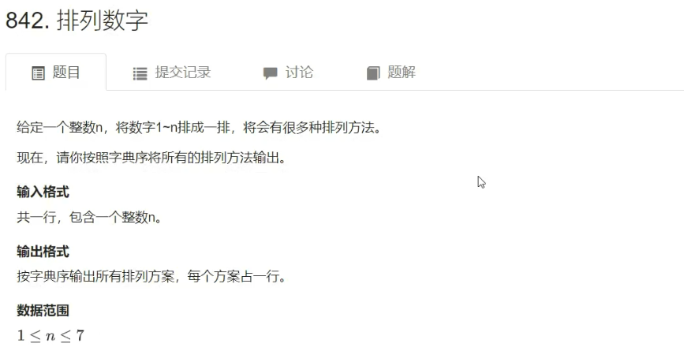
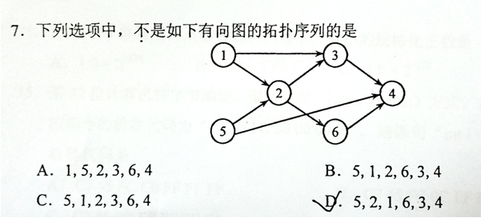

## 深度优先搜索 DFS

> DFS是一个执着的人

+ ==回溯==

+ ==剪枝==

### 1. 排列数字



+ 代码

```C++
#include <iostream>

using namespace std;

const int N = 10;

int n;
int path[N]; // 收集的路径
bool st[N]; // 标记某个点是否访问过

// u: 当前搜索到第几层，当搜索到第n层时可以收获结果了（从第0层开始搜索）
void dfs(int u)
{
    if (u == n)
    {
        for (int i = 0; i < n; i ++ ) printf("%d ", path[i]);
        puts("");
    	return;
    }
    
    for (int i = 1; i <= n; i ++ )
        if (!st[i])
        {
            path[u] = i;
            st[i] = true;
            dfs(u + 1);
            // path不需要恢复，因为它是数组，每次回溯都会被覆盖掉
            st[i] = false; // 回溯：恢复现场
        }
}

int main()
{
    cin >> n;
    
    dfs(0);
    
    return 0;
}
```


### 2. [N-皇后问题](https://www.acwing.com/problem/content/1623/)

- 思路：DFS

+ 解法一，最坏时间复杂度 $O(nn!)$

```C++
#include <iostream>

using namespace std;

const int N = 20; // 对角线的个数是2n-1，所以开2倍的N

int n;
char g[N][N];
bool col[N], dg[N], udg[N];

void dfs(int u)
{
	if (u == n)
	{
		for (int i = 0; i < n; i ++ ) puts(g[i]);
		puts("");
		return;
	}
	
	for (int i = 0; i < n; i ++ )
	{
		if (!col[i] && !dg[u + i] && !udg[n - u + i])
		{
			g[u][i] = 'Q';
			col[i] = dg[u + i] = udg[n - u + i] = true;
			dfs(u + 1);
			col[i] = dg[u + i] = udg[n - u + i] = false;
			g[u][i] = '.';
		}
	}
}

int main()
{
	cin >> n;
	
	for (int i = 0; i < n; i ++ )
		for (int j = 0; j < n; j ++ )
			g[i][j] = '.';
	
	dfs(0);
	
	return 0;
}
```

+ 解法二，时间复杂度$O(2^{n^2})$，效率比解法1差一些

```C++
#include <iostream>

using namespace std;

const int N = 20; //此处x轴和y轴的长度为10，开20是大了，但是对角线长度约1.414*10（根号2），所以数组开大有好处

int n;
char g[N][N];
bool row[N], col[N], dg[N], udg[N]; //col是Column（列）的缩写，dg是diagonal（对角）的缩写，（反对角线前面的u想不出了）
//设udg的方程为y=x+b则b=y-x，替换后b=u-i，防止出现负数，则加上n，则有b=u+n-i（其实b=n+i-u也可，目的是一个对角线能单独映射）
//设dg的方程为y=-x+b,b=y+x,替换后b=i+u,perfect

// 位置（x，y），以及当前有多少个皇后：s
void dfs(int x, int y, int s)
{
	if (y == n) y = 0, x ++ ; // 如果y越界，说明该搜索下一行了
	
	if (x == n) // 如果搜索结束
	{
		if (s == n) // 并且皇后个数为n
		{ // 输出结果
			for (int i = 0; i < n; i ++ ) puts(g[i]);
			puts("");
		}
		return; // 否则，直接return
	}
	
	// 不放皇后
	dfs(x, y + 1, s);
	
	// 放皇后（只有满足一下条件才能放皇后）
	if (!row[x] && !col[y] && !dg[x + y] && !udg[x - y + n])
	{
		g[x][y] = 'Q';
		row[x] = col[y] = dg[x + y] = udg[x - y + n] = true;
		dfs(x, y + 1, s + 1);
		row[x] = col[y] = dg[x + y] = udg[x - y + n] = false;
		g[x][y] = '.';
	}
}


int main()
{
	dfs();
	
	return 0;
}
```

*****

## 宽度优先搜索 BFS

> BFS是一个稳重的人

- 要求：权重必须是1或相同。

### 1. [走迷宫]()


```
输入
5 5
0 1 0 0 0
0 1 0 1 0
0 0 0 0 0
0 1 1 1 0
0 0 0 1 0
输出
8
```

+ 代码

```C++
#include <iostream>
#include <cstring>
#include <algorithm>

using namespace std;

const int N = 105;

typedef pair<int, int> PII;

int n, m;
int g[N][N]; // 存放图
int d[N][N]; // 存放每个点到起点的距离
PII q[N * N]; // 队列
PII prev[N][N];

int bfs()
{
    int hh = 0, tt = 0;
    q[0] = {0, 0};

	memset(d, -1, sizeof d);
    d[0][0] = 0;
    int dx[4] = {-1, 0, 1, 0}, dy[4] = {0, 1, 0, -1};
    
    while (hh <= tt)
    {
        auto t = q[hh ++ ];
        
        for (int i = 0; i < 4; i ++ )
        {
            int x = t.first + dx[i], y = t.second + dy[i];
        	if (x >= 0 && x < n && y >= 0 && y < m && g[x][y] == 0 && d[x][y] == -1)
            {
                d[x][y] = d[t.first][t.second] + 1;
            	prev[x][y] = t;
                q[ ++ tt] = {x, y};
            }
        }
    }
    
    int x = n - 1, y = m - 1;
    while (x || y)
    {
        cout << x << ' ' << y << endl;
        auto t = prev[x][y];
        x = t.first, y = t.second;
    }
    
    return d[n - 1][m - 1];
}

int main()
{
    cin >> n >> m;
    for (int i = 0; i < n; i ++ )
        for (int j = 0; j < m; j ++ )
            cin >> g[i][j];
    
    cout << bfs() << endl;
    
    return 0;
}
```

****

### 2.[八数码](https://www.acwing.com/problem/content/181/)

求最小步数，可以用BFS来做。

把操作的每一步抽象成一个点，求出从起点走到终点所需要的最小步数。

- 难点在于如何把状态抽象表示成一个节点？

1. 状态表示复杂，如何把状态存进队列中？用字符串`queue<string>`存。
2. 如何来记录每个状态的距离？用哈希表`unordered_map<string, int> dist`存。
3. 如何做状态转移？
   + 把字符串恢复成`3x3`表格
   + 分别枚举每个移动
   + 把移动后的表格变回字符串

+ 代码

```C++
#include <iostream>
#include <algorithm>
#include <unordered_map>
#include <queue>

using namespace std;

const int N = 100;

int bfs(string& start)
{
	string end = "12345678x";
	
	queue<string> q;
	unordered_map<string, int> d;
	
	q.push(start);
	d[start] = 0;

	int dx[4] = {1, 0, -1, 0}, dy[4] = {0, 1, 0, -1};

	while (q.size())
	{
		auto t = q.front();
		q.pop();

		int distance = d[t]; // 记录步数
		if (t == end) return distance;

		// 状态转移
		int k = t.find('x'); // 找到当前x的位置
		int x = k / 3, y = k % 3; // 转换成其在表格中的位置(x, y)
		for (int i = 0; i < 4; i ++ ) // 分别枚举其下一步可能出现的其他位置
		{
			int a = x + dx[i], b = y + dy[i]; // 下一步x的可能位置(a, b)
			if (a >= 0 && a < 3 && b >= 0 && b < 3)
			{
				swap(t[k], t[a * 3 + b]); // 交换位置

				if (!d.count(t)) // 如果之前没有出现过这个表格，则将其放入队列中
				{
					d[t] = distance + 1; // 步数+1
					q.push(t);
				}

				swap(t[k], t[a * 3 + b]); // 恢复位置，进行下一个可能的x位置判断
			}
		}
	}
	return -1; // 找不到终点，返回-1
}


int main()
{
    string start;

    for (int i = 0; i < 9; i ++ )
    {
    	char c;
    	cin >> c;
    	start += c;
	}

    cout << bfs(start) << endl;
    
	return 0;   
}
```

****

## 图的存储结构

- 一般来说有两种存储方式，邻接矩阵和邻接表。

> 树是一种特殊的图（无环连通图）

- 图，分为有向图和无向图。无向图也可以看作是一种特殊的有向图。

- 有向图的存储方式

  - 邻接矩阵：空间复杂度：$O(n^2)$，浪费空间

  - **邻接表**（用的最多）

****

### 1. 树的重心


+ 代码

```C++
#include <iostream>
#include <cstring>
#include <algorithm>

using namespace std;

const int N = 100010, M = N * 2;

int n;
int h[N], e[M], ne[M], idx;
bool st[N];

int ans = N;

// 新增一条边：a -> b
void add(int a, int b)
{
    e[idx] = b;
    ne[idx] = h[a];
    h[a] = idx ++ ;
}

// u:当前遍历的点
// 返回以u为根的子树中 点的数量
int dfs(int u)
{
    st[u] = true; // 标记一下，已经被搜过了
    int sum = 1, res = 0;
    for (int i = h[u]; i != -1; i = ne[i])
    {
        int j = e[i];
        if (!st[j])
        {
            int s = dfs(j); // 当前子树的大小
            res = max(res, s);
            sum += s;
        }
    }
    
    res = max(res, n - sum);
    ans = min(ans, res);
    return sum;
}

int main()
{
    cin >> n;
    
    memset(h, -1, sizeof h);
    
    for (int i = 0; i < n - 1; i ++ )
    {
        int a, b;
        cin >> a >> b;
    	add(a, b), add(b, a);
    }
	
    dfs(1);
    
    cout << ans << endl;
    
    return 0;
}
```

****

### 2. [图中点的层次]()


```
输入
4 5
1 2
2 3
3 4
1 3
1 4
输出
1
```

+ 代码

```C++
#include <iostream>
#include <cstring>
#include <algorithm>

using namespace std;

const int N = 100010;

int n, m;
int h[N], e[N], ne[N], idx; // 邻接表
int d[N], q[N];

void add(int a, int b)
{
    e[idx] = b, ne[idx] = h[a], h[a] = idx ++ ;
}

int bfs()
{
    int hh = 0, tt = 0;
    q[0] = 1;
    
    memset(d, -1, sizeof d);
    d[0] = 0;
    
    while (hh <= tt)
    {
        // 取得当前点
        int t = q[hh ++ ];
        // 扩展它的每一个点
        for (int i = h[t]; i != -1; i = ne[i])
        {
            int j = ne[i];
            if (d[j] == -1)
            {
                d[j] = d[t] + 1;
                q[ ++ tt] = j;
            }
        }
    }
    
    return d[n];
}

int main()
{
    cin >> n >> m;
    
    memset(h, -1, sizeof h);
    
    for (int i = 0; i < m; i ++ )
    {
        int a, b;
        cin >> a >> b;
        add(a, b);
    }
    
    cout << bfs() << endl;
    
    return 0;
}
```

****

## 拓扑序列

**拓扑序列是图的宽搜的一个应用**

- 拓扑序列只针对**有向图**，无向图是没有拓扑序列的。

- **定义：在拓扑序列中，所有的边都是从前指向后的。**



- **只要存在环，就不可能存在拓扑序列。**

- **一个有向无环图一定存在一个拓扑序列，因此有向无环图也被称为拓扑图**。

- **所有入度为0的点都可以排在当前最前面的位置，作为拓扑序列的起点。**
- **一个有向无环图一定至少存在一个入度为0的点。**

- 算法步骤

  1. 把所有入度为`0`的点入队。
  
  
    2. BFS：将扩展每一个点改为枚举它的所有出边`t -> j`，然后再删掉边`t -> j`。
  


****

### 1. 有向图的拓扑序列


```
输入
3 3
1 2
2 3
1 3
输出
1 2 3
```

+ 代码

```C++
#include <iostream>
#include <algorithm>
#include <cstring>

using namespace std;

const int N = 100010;

int h[N], e[N], ne[N], idx;
int q[N], d[N]; // d:入度

void add(int a, int b)
{
    e[idx] = b, ne[idx] = h[a], h[a] = idx ++ ;
}

bool topsort()
{
    int hh = 0, tt = 0;
    for (int i = 1; i <= n; i ++ )
    	if (!d[i])
            q[ ++ tt] = i;
    
    while (hh <= tt)
    {
        int t = q[hh ++ ]; // 取出队头元素，并出队
        for (int i = h[t]; i != -1; i = ne[i]) // 扩展每一个出边
        {
            int j = ne[i];
            d[j] -- ;
            if (d[j] == 0) q[ ++ tt] = j;
        }
    }
    
    return tt == n - 1; // 如果所有点都入过队，就证明找到拓扑序列了，并且q中存的就是拓扑序列
}

int main()
{
    cin >> n >> m;
    memset(h, -1, sizeof h);
    
    for (int i = 0; i < m; i ++ )
    {
        int a, b;
        cin >> a >> b;
        add(a, b);
        
        d[b] ++ ;  // 节点b的入度+1
    }
    
    if (topsort())
    {
        for (int i = 0; i < n; i ++ ) printf("%d ", q[i]); // 此时q中的队列恰好就是拓扑序
        puts("");
    }
    else puts("-1");
    
    return 0;
}
```

