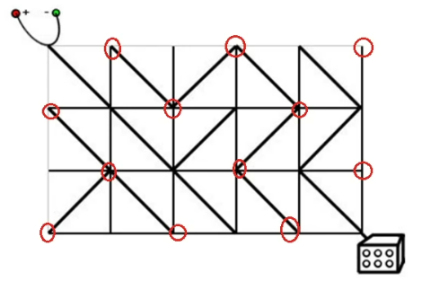
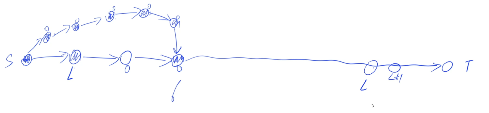

# BFS

> 与动态规划一样，搜索是一个以应用为主的算法。

- 搜索分为两种：DFS和BFS。下文主要讨论BFS的一些常见模型。

- 其中BFS还可以继续分为两大类：

1. 最短距离：走迷宫问题，给定一张图以及起点和终点，求从起点走到终点的最短距离。	
2. 最小步数：也是最短距离模型，但是将每个操作抽象成每一步，把整个地图看成是一个点（或状态）。求从其中一种地图变成另外一种地图的最小步数。

> BFS涉及到的模型：Flood Fill，最短路模型，多源BFS，最小步数模型，双端队列广搜，双向广搜，A*。

**BFS的特点：1. 求最小（第一次搜到的就是最小值）；2. 基于迭代，不会暴栈。（当层数很深的时候，优先选择BFS而不是DFS）**

****

## Flood Fill

顾名思义，叫做洪水覆盖算法，或者洪水填充算法。

给定一个地图，以及`洼地`和`高地`，往任一个`洼地`注水，水蔓延到其它洼地的过程就是宽搜的过程。

**这就是`Flood Fill算法`，可以在线性时间复杂度内，找到某个点所在的连通块。**

Flood Fill算法既可以用深搜实现，也可以用宽搜实现，但是为了防止暴栈的问题，尽量用宽搜实现。

#### 1. [池塘计数](http://ybt.ssoier.cn:8088/problem_show.php?pid=1249)

- 思路：Flood Fill 秒了

- [代码](E:\codes\C++\AcwingTest\池塘计数.cpp)

****

#### 2. [城堡问题](http://ybt.ssoier.cn:8088/problem_show.php?pid=1250)

- 思路：Flood Fill 秒了

- [代码](E:\codes\C++\AcwingTest\城堡问题.cpp)

****

#### 3. [山峰和山谷](http://ybt.ssoier.cn:8088/problem_show.php?pid=1454)

- 思路：Flood Fill 秒了

同时，该算法还可以维护很多信息，例如，周长、面积等等。

- [代码](E:\codes\C++\AcwingTest\山峰和山谷.cpp)

****

## 最短路模型

#### 1. [迷宫问题](http://ybt.ssoier.cn:8088/problem_show.php?pid=1255)

- 思路：BFS秒了

BFS中常用的记录路径的方式，将`bool st[N][N]`替换成`PII pre[N][N]`，存储每个点是由哪个点走过来的，然后输出的时候倒序输出即可。还有一种方式是开一个新的数组记录路径。

- [代码](E:\codes\C++\AcwingTest\迷宫问题.cpp)

****

#### 2. [武士风度的牛](https://www.acwing.com/problem/content/190/)

- 思路：BFS秒了

- [代码](E:\codes\C++\AcwingTest\武士风度的牛.cpp)

****

#### 3. [抓住那头牛](http://ybt.ssoier.cn:8088/problem_show.php?pid=1253)

- 思路：BFS秒了

在`X`与`X-1`、`X+1`、`2X`之间各连一条边，且距离是1。

注意本题代码中的范围！！！

最大能$\times 2$的地方就是当`X`在$10^5-1$的点，因此最多`X`会跳到$2\times 10^5-2$，之后K只可能在其左边，因此本题的N要开到$2\times 10^5$，且范围限制也是如此。


- [代码](E:\codes\C++\AcwingTest\抓住那头牛.cpp)

****

## 多源BFS

#### 1.[矩阵距离](https://www.acwing.com/problem/content/175/)

- 思路

BFS秒了。详见代码。

- [代码](E:\codes\C++\AcwingTest\矩阵距离.cpp)

****

## 最小步数模型

#### 1. [魔板](https://www.acwing.com/problem/content/1109/)

- 思路

本题把整个棋盘看作是一个点，每个点可以进行3种操作，变成另外3种状态（看作是3个不同的点），然后求初始棋盘到目标棋盘的最少步骤（点与点之间可构建一个有向图）。该类问题就是**最小步数模型**。

目标：从初始状态图变成目标图的最少步骤，并且输出变换过程的操作。

- 如何判断是否到达目标状态？一般用**哈希法**（对应C++中的map或unordered_map(C11)）。
- 如何记录方案？存储每个状态是由哪个状态转移过来的即可，然后从终点倒推到起点。
- 如何保证按照最小字典序输出？在队列的插入时，按照操作A，B，C的顺序来扩展即可。

- [代码](E:\codes\C++\AcwingTest\魔板.cpp)

****

## 双端队列BFS

#### 1. [电路维修](https://www.acwing.com/problem/content/177/)

- 思路

相当于给定一张无向图，图中只有两种边：边权是0 和 边权是1 的边。求图中从起点到终点的最短路径。

注意：图中有一半的点是永远不可能到达的。

**无解当且仅当起点和终点的奇偶性不同。**

因此，这道题就是一道只包含0和1的边权的最短路题目。

这种题有一个经典的做法：**双端BFS**

> 双端BFS与一般的BFS只有一点不一样：
>
> - 一般的BFS是每次把队友取出来，然后把队头能扩展到的所有元素放到队尾去
> - **双端BFS是判断一下从队头扩展到的元素的权重是0还是1，若是0就插到队头，若是1则插到队尾。**
>
> 就这一点不一样，其他的与一般BFS完全一样。

- 证明

通用证明：把问题转换成Dijkstra模型即可。

证明：1.两段性；2.单调性。


每次扩展后仍然具有两段性和单调性。证毕。

如何能从一个点直接走到另一个点，边权就是0。如果必须得转一下才能走到另一个点，边权就是1。

- [代码](E:\codes\C++\AcwingTest\电路维修.cpp)

****

## 双向BFS

BFS的优化方式之一：`双向BFS`和`A*`。

顾名思义，从两个方向同时搜索，从而提高效率

例如，八数码这道题，总共有$9!$个状态，这其实还不算多。如果碰到状态非常庞大的题目，我们还从起点开始搜终点，毫无疑问会TLE，因此，需要考虑优化：双向BFS。

- 转换成图论问题：把状态u与其能够变到的状态v连一条长度为1的边。

这道题的字符串长度最多20位，变换规则有6种，且限制10步内没找到答案认为无解，因此，在朴素暴搜中最多能遍历到的状态有$(20 \times 6)^{10} = 120^{10}$级别，即使这道题只选中其中一种变换那么也会有$6^{10}$级别，还是可能TLE。

- **双向BFS一般用在求`最小步数`的模型中，不能适用于其他BFS问题：`最短路`、`Flood Fill`等。**

- 双向BFS的实现方式有很多种

  - 最一般的情况是每次从两个方向各扩展一次

  - 优化版本：在扩展时，每次选择当前队列中元素数量较少的一方来扩展，这样就可以做到两方平衡，实际效果会好一些。


#### 1. [字串变换](https://www.acwing.com/problem/content/192/)

- 思路：双向广搜秒了。
- 注意：本题需要特判初始`A==B`的情况！

- [代码](E:\codes\C++\AcwingTest\字串变换.cpp)

****

## A*

- **`A*`算法是一个非常重要的算法。**

- **应用场景**：与双向BFS的应用场景相同，在一个非常庞大的解空间中寻找出最优解。同样不适用于最短路模型等解空间不是很大的题型中。只有在图中点的数量非常多的题目中才会体现出效果来。

- **启发函数**：作用是让我们从起点开始搜，只需要搜非常少的一些状态就可以搜到从起点到终点的最短路径。

- **算法流程**

  1. 把BFS当中的队列换成优先队列（小根堆）`priority_queue`。（排序方式：真实距离+估计距离）

  2. 每次取出优先队列的队头`t`。

  3. 当终点第一次出队时，break。
  4. 扩展`t`的所有邻边，将邻边入队

> **每个状态在队列中存的时候，要存：1.从起点到当前点的真实距离；2.从当前点到终点的估计距离。**

- 代码模板

```c++
while (!q.empty())
{
    t <- 优先队列的队头
    当终点第一次出队时，break;
    for t的所有邻边
        将邻边入队（这边可以加个小判断做优化）
}
```

- **`A*`算法能处理的图的边权不一定都得是1，只要不存在负权回路即可。**

- `Dijkstra`算法与`A*`算法很像，像是一种特殊的`A*`算法，即所有估计距离都取 0的`A*`算法。

- `A*`算法的正确性

假设当前状态为`state`。`d(state)`表示从起点到`state`的距离，`g(state)`表示从`state`到终点的距离，`f(state)`表示从`state`到终点的估计距离。

要想`A*`算法成立，必须满足$f(state) \le g(state)$，且越接近越好。`f(state)`越接近`g(state)`，剪掉的空间就越多，最坏`f(state)`取0，退化成`Dijkstra`算法。

> 在使用A*算法前，必须保证有解，否则它还是会把所有状态全部搜索一遍。效率比朴素BFS还低。

- 证明`A*`算法的正确性

反证法。假设从终点T从优先队列当中出队的时候不是最小值，意味着此时$d > d_{最优}$，假设最优解的状态是`u`，那么$d(u) + f(u) \le d(u) + g(u) = d_{最优}$，则$d > d_{最优} \ge d(u)+f(u)$。即优先队列中存在比T更优的队头元素，矛盾。

- **`A*`算法不能保证除了终点外的其他点的第一次出队的时候的距离最短。**



- `A*`算法与其他算法的不同之处：**每次出队的时候不是判重而是更新距离**。只有终点第一次出队才是正确的，其他点出队一次就要更新一次。`BFS`是在入队的时候判重，`Dijkstra`在出队的时候判重，`A*`不能判重。

****

#### 1. [八数码](https://www.acwing.com/problem/content/181/)

- 思路

把一张状态图按照顺序读出来，如图所示：

上图对应的序列为：`1 3 6 4 2 8 7 5`。

**一个状态图有解的充要条件是其对应序列中的逆序对数量是偶数**。

- 必要性证明

1. 若空格在水平方向上移动的话，并没有改变逆序对的数量。


2. 若空格在竖直方向上移动，相当于将移动的数字往后（或往前）移动`2`个位置。

   **此时改变的逆序对只有两对**。例如下图中只改变了`2`和`7`以及`2`和`8`的关系，其余逆序对的关系不变。相当于每一次移动并不会改变逆序对的奇偶性，每次改变后逆序对数量`+2`或`-2`。最终解的逆序对数量等于`0`，因此，初始状态的逆序对数量必须为偶数才有解。


- 充分性证明相当复杂，不讲。

- **上述结论对所有边长为`n`（n为奇数）的数码问题都成立。**

****

- 如何构造启发函数？

我们可以发现，每次移动一个数，都只会改变那个数的位置，最好的情况下，每一次移动都会将某个数向它的目标方向移动一格，但是在大多数情况下，都需要”迂回“一下，才能到达目标位置。**因此，启发函数（估价函数）可以取：当前状态中每个数的位置与其目标位置的曼哈顿距离之和。**因为每一次都可以使得曼哈顿距离减1，这样取的话，估价函数就一定小于等于真实值的，而且还是比较接近真实值的。

- [代码](E:\codes\C++\AcwingTest\八数码AStar.cpp)

****

#### 2. [第K短路](https://www.acwing.com/problem/content/180/)

- 思路

如何枚举到所有的路线？

每次把当前点所有能扩展到的点全部入队，在求最短路中，是将能更新它的点加进来，而本题求的是第K短路，因此需要将所有点都加进来（相当于暴搜）。但是暴搜的范围非常庞大，因此，我们需要想到用一个强而有力的搜索方式使得只遍历其中很小的一部分点就可以找到答案，这样我们就发现了：这道题特别适合用`A*`算法来做。

**估价函数：每个点到终点的最短距离。**这个值特别适合用来做估价函数值，既大于等于0，又一定小于最终走的路线距离，非常完美。

1. 如何求估价函数呢？直接跑一遍`Dijkstra`就可以了。

2. 如何求出来第K短路？

由A*算法可知，当终点第一次从队列中弹出来的时候一定是最小值，直观上来想，第一次弹出来是最小的，那么第二次弹出来是不是就是第二小的，...，第K次弹出来是不是就是第K小的？证明：上面已经证明过了第一次弹出来的一定是最小值，那么第二次弹出来的话，证明方式与证明第一次弹出来是最小值的方式一样：**反证法**，若第二次弹出来的值$dist^2$不是第2小的值，则有$dist^2 > d_{第2小}$，那么对于第2短路这条路线上的某一个点$v$，有$d_{第2小}\ge d(v)+f(v)$，因此我们可以发现$v$这个点的估计值是严格小于终点的最小值的，因此，终点是不可能先被弹出来的，矛盾。以此类推，可证得第K次弹出来的就是第K小的。

- [代码](E:\codes\C++\AcwingTest\第K短路.cpp)
