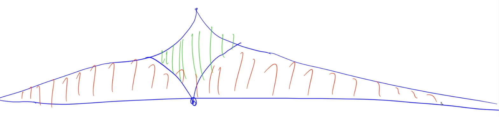
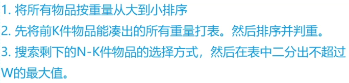
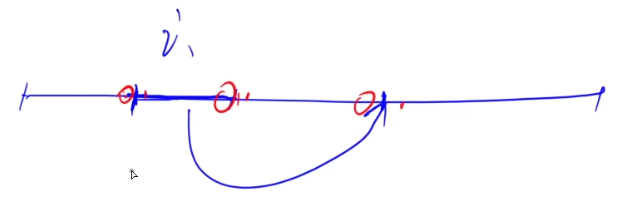

# DFS

深搜指的是一条路走到黑的搜索方式，宽搜和队列`queue`相关，而深搜与栈`stack`相关。

下文从以下几种方面介绍DFS。

## 连通性模型

这种模型既可以用深搜来做，也可以用宽搜来做。

### 1. [迷宫](http://ybt.ssoier.cn:8088/problem_show.php?pid=1215)

- 思路

这道题当然可以用BFS来做，而且用BFS不仅可以求出能否从A点走到B点，还能求出从A点走到B点的最短距离，需要注意的是，DFS只能求出来能否从A点走到B点，也就是A和B是否连通，不能求出最短距离。（这也是DFS的局限性）

那么用DFS做有什么好处呢？**好处：代码短，写的时候速度会快很多。**

但是要注意，在用DFS前一定要估算一下会不会暴栈！如果会，那么就需要把递归写法改成非递归或者用迭代的方式去做这道题。

- [代码](E:\codes\C++\AcwingTest\迷宫.cpp)

****

### 2. [红与黑](https://www.acwing.com/problem/content/1115/)

- 思路

Flood Fill模型，可以用DFS来实现Flood Fill算法。

- [代码](E:\codes\C++\AcwingTest\红与黑.cpp)

****

## 搜索顺序

`搜索顺序`是下面所有模型的一个基础。

暴搜不同于DP，需要考虑最优解，暴搜很简单，只需要把所有方案不遗漏的全部枚举到即可。

这一小节，主要讲的就是DFS可以按照什么样的顺序去搜可以把全部的状态搜索出来。

****

### 1. [马走日](http://ybt.ssoier.cn:8088/problem_show.php?pid=1219)

- 思路

本题就是简单的DFS应用，把所有能够到达的点全部枚举出来就行了。

- [代码](E:\codes\C++\AcwingTest\马走日.cpp)

****

### 2. [单词接龙](http://ybt.ssoier.cn:8088/problem_show.php?pid=1220)

- 思路

把每个字符串抽象成一个点，若串B能接到到串A的后面，则在A与B之间连一条有向边`A->B`，预处理这样一个二维矩阵，然后再去暴搜。这道题也是一个外部搜索（需要恢复现场），不是内部搜索（不需要恢复现场）。每个单词最多只能被用2次，因此搜索的层数最多只有40层。

- [代码](E:\codes\C++\AcwingTest\单词接龙.cpp)

****

### 3. [分成互质组](http://ybt.ssoier.cn:8088/problem_show.php?pid=1221)

- 思路

如何枚举到所有方案呢？

- 一个组一个组的枚举，总共有2种决策：

1. 把某个数加到最后一组中
2. 新开一个组

**当既可以做第一个决策也可以做第二个决策时，其实是没有必要做第二个决策的。**因为若一个数放在新开的那个组中会得到一个最优解，那么该数字放在最后一组中也是可以得到一个最优解的，不会影响最后一组和新开的那一组中原有数字之间的关系。因此这也算是一种**剪枝**的操作，可以少枚举一些分支。

**优化2**：由于一组中数之间的排列是不影响组内关系的，**因此搜索的时候一定要按照`组合`的方式来搜**，而不是按照`排列`的方式来搜。

- [代码](E:\codes\C++\AcwingTest\分成互质组.cpp)

****

## 剪枝与优化

**常用的剪枝方式：《算法竞赛进阶指南》P116**

1. 优化搜索顺序

   大部分情况下，我们应该优先搜索**分支较少**的节点。

2. 排除等效冗余

   相当于告诉我们：如果不考虑顺序，尽量用`组合`的方式去搜索。

3. 可行性剪枝

   搜索中可能搜到一半就发现不合法了，那么就提前退出。

4. 最优性剪枝

   如果当前方案花费的代价已经超过最优解了，就直接退出。

5. 记忆化搜索（DP）

****

### 1. [小猫爬山](https://www.acwing.com/problem/content/167/)

- 思路

本题N的范围很小，才18，就是在提示我们用暴搜来做。

- **搜索顺序**

**从前往后依次枚举每一只小猫，每一次再枚举当前这只小猫应该放在哪辆车上。**这样就可以把所有的方案全部搜索到，保证不漏。


搜索的层数一共有`n`层。

DFS的时间复杂度都不太好算，反正是指数级别就对了。上述朴素版DFS的时间复杂度较高，需要考虑剪枝与优化。

- **如何剪枝？**

1. **优化搜索顺序**：**把一只重的猫放在车上带来的分支比把一只轻的猫放在车上少**，因此，优化搜索顺序，优先放重的猫。

2. 无等效冗余。
3. **可行性剪枝**：如果当前这只猫放在某一辆车上后超重了，则可以直接剪掉这个分支。
4. **最优性剪枝**：如果当前的车的数量已经大于等于全局最优解，则直接剪枝。

- [代码](E:\codes\C++\AcwingTest\小猫爬山.cpp)

****

### 2. [数独](https://www.acwing.com/problem/content/168/)

- 思路

1. 搜索顺序：先随意选择一个空格子，枚举当前这个空格子上可以填哪些数字，以此类推。当我们把所有空格子都枚举完之后，就找到了一个解。

2. 剪枝

   1. **优化搜索顺序**：如果一个格子能填9个数字的任一个数字，而另一个格子只能填2个数字中的任一个数字，则优先枚举只能`填2个数字中的任一个`（即分支最少）的那个空格子。
   2. 无等效冗余。
   3. **可行性剪枝**：当前格子所能填的数字必须合法才能填。
   4. 最优性剪枝：无，因为本题是寻找可行解而不是找最优解。

3. **优化**

   虽然本题的剪枝不多，但是用到了**位运算优化**，可以帮助我们快速判断可以填哪些数字。

   - 优化1：用一个9位的二进制数表示`某一行、某一列、某一九宫格`的状态，其中`1`表示该位数字还没被填上，例如，某一行的01串为：`010011100`，则表示该行可以填的数字有`2 5 6 7`。然后对这3个01串取交集（做按位与运算`&`即可），就可以得到当前格子真正可以填的数字。
   - 优化2：将做与运算后得到的01串，做`lowbit`操作（时间复杂度：$O(1)$），就可以得到所有能够填的数字有哪些，而不是对每一个得到的01串做一个`for`循环判断，`lowbit`可以显著降级时间复杂度（有几个`1`就循环几次，而不是每次都循环`9`次）。

- [代码](E:\codes\C++\AcwingTest\数独.cpp)

****

### 3. [木棒](https://www.acwing.com/problem/content/169/)

- 思路

1. **搜索顺序**：从小到大枚举木棒长度（木棒指未被砍断的木头），再依次枚举每一根木棒是由哪些木棍拼出来的（木棍指的是被砍断后的木头）。这样就可以保证枚举到所有方案。

2. **剪枝与优化**
   1. 木棒的长度必须是所有木棍长度之和的**约数**才有解。
   2. 优化搜索顺序：枚举木棍时，优先枚举长度较长的木棍可以导致分支数量减少，即从大到小枚举。
   3. 排除等效冗余：
      1. **按照组合数方式枚举。**即在每一根木棍的内部，放编号1，2，3的木棍与放编号1，3，2的木棍是等效的，因此枚举的时候按照`组合`的方式枚举，在传参时添加一个`start`参数即可。除了按照`组合`的方式枚举之外，
      2. **如果当前木棍加到当前木棒中失败了，则直接略过后面所有与当前木棍长度相等的木棍。**即如果在拼接木棒时，用编号为3的木棍拼接后导致拼接失败，若编号为4的木棍与编号为3的木棍长度相同，那么用编号为4的木棍拼接也一定会失败，此时就可以直接跳过编号为4的木棍了。证明：反证法，如果用编号4可以，由于编号3与4等长，又因为编号3不行，矛盾，那么编号3也一定可以。
      3. **如果是拼接木棒的第一根木棍失败了，则当前方案一定失败。**反证法，若编号3的木棍放到开头失败了，但是放到另一个木棒的非开头位置却有解，那么在另一个木棒中，根据第（1）点可知，每一个木棒内部的木棍顺序是可以任意交换的，因此把编号3的木棍换到另一个木棒的开头位置，居然有解，矛盾。
      4. **如果是拼接木棒的最后一根木棍失败了，则当前方案一定失败。**与第（3）点对称。
   4. 可行性剪枝：若当前木棒与木棍`i`拼接后的长度超出原定长度，则剪枝。

- [代码](E:\codes\C++\AcwingTest\木棒.cpp)

****

### 4. [生日蛋糕](https://www.acwing.com/problem/content/170/)

- 思路

设最上面那层设为第`1`层，最底下为第`m`层，则总面积$S=\pi R_m^2+\sum_{i=1}^{m}2\pi R_iH_i$。

题目所求的$Q=S\pi$，即$Q=R_m^2 + \sum_{i=1}^{m}2R_iH_i$。则$Q$一定是个正整数。

1. 搜索顺序：**自底向上搜**。

2. 剪枝与优化

   1. 优化搜索顺序：在每一层内部，**先枚举$R$，再枚举$H$**，因为公式中$R$是平方级别的，因此先枚举$R$。同时，**从大到小枚举$R,H$**。

   2. 可行性剪枝：枚举到第`u`层时，$R_u$的范围：$u\le R(u)\le R(u+1)-1$，同时还有体积的限制：$N-V\ge R^2H$，其中$H$最小值可以取1，则有$R\le \sqrt{N-V}$。因此有：$u\le R(u)\le min\{R_{u+1}-1, \sqrt{N-V}\}$。同理，$H_u$的范围：$u\le H_u \le min\{H_{u+1}-1,\frac{N-V}{R^2}\}$。

   3. 预处理前`u`层的体积最小值`minV(u)`和表面积最小值`minS(u)`，则可以保证有`V + minV(u) <= N`（可行性剪枝），`S + minS(u) < ans`（最优性剪枝）。其中`V`指当前体积，`S`指当前面积。

   4. $前u层的总面积S_{1\sim u}=\sum_{k=1}^{u}2\pi R_kH_k = \frac{2}{R_{u+1}}\sum_{k=1}^uR_kH_kR_{u+1} > \frac{2}{R_{u+1}}\sum_{k=1}^uR_k^2H_k = \frac{2(N-V)}{R_{u+1}}$

      $前u层的总体积V_{1\sim u}=N-V=\sum_{k=1}^{u}\pi R_k^2H_k$

      也就是说$S_{1\sim u} > \frac{2(N-V)}{R_{u+1}}$，即$S+S_{1\sim u} \ge \frac{2(N-V)}{R_{u+1}}$，因此若$S+\frac{2(N-V)}{R_{u+1}} \ge ans$了就可以直接剪枝。

   其中第4个剪枝是最重要的，少了这个剪枝就可能TLE。

- [代码](E:\codes\C++\AcwingTest\生日蛋糕.cpp)

****

## 迭代加深

搜索过程中，可能会碰到这种情况：答案在浅的那一个分支上，但是搜索可能先去一层特别深的分支上搜，从而导致浪费了很多时间。而迭代加深就能很好的解决这种问题。

- 迭代加深就是一层一层来搜，看起来比较像宽搜，但是又不太一样，迭代加深的每一层会定义一个`层数上限(max_depth)`，每一次搜的时候若发现层数大于`max_depth`，就直接剪掉。相当于划定一个搜索区域，若在该区域内搜到的答案，那么该答案就是最优解，否则扩大搜索区域，继续搜索，`max_depth`一般从0开始递增。

- 与宽搜的区别：宽搜的空间复杂度是指数级别的，迭代加深本质上还是一个DFS，因此空间复杂度是$O(n)$级别。BFS特别浪费空间，DFS则不会。

- 当`max_depth`越大时，每次搜索前面那几层会不会非常浪费时间？答案是不会，因为搜索最后一层所需的时间一般大于等于搜索前几层所用的时间，在大多数情况下，搜索前几层所用时间远比单独搜索最后一层所用时间短，甚至可以忽略不计。

****

### 1. [加成序列](https://www.acwing.com/problem/content/172/)

- 思路

先看一下加成序列的长度增长规模：`1 2 4 8 16 32 64 128`，只需要8层就能搜到128了，因此本题答案在很浅的层数中，而如果朴素暴搜的话，最多会搜1到100内的每个数，也就是会搜100层。因此本题特别符合用迭代加深来做。

1. 搜索顺序：依次考虑每个数可以填什么。

2. 剪枝
   1. 优化搜索顺序：**从大到小枚举下一个数**，优先枚举较大的数，会更快找到答案。
   2. **排除等效冗余：如果某两对数的和相等，只需要枚举其中一对数即可。**例如已经构造了序列`1 2 3 4`，判断最后一个是否可以填5，5可以被`1+4`构造出来，也可以被`2+3`构造出来，只需要枚举到其中一种情况即可，因此，可以开一个`bool`数组判断某个数是否被枚举过。

- [代码](E:\codes\C++\AcwingTest\加成序列.cpp)

****

## 双向DFS

与双向BFS思想一样，若搜索范围特别庞大，从起点想要搜到终点耗时特别长，此时就需要终点往起点搜，也就是双向搜索。



这样，搜索的范围就是绿色部分，剪掉了红色部分范围，大大提高效率。

****

### 1. [送礼物](https://www.acwing.com/problem/content/173/)

- 思路

类似背包问题，可以用背包问题的思路求解，但是背包问题的时间复杂度为$O(NV)$，而本题V的范围特别大，因此不能用DP做，我们发现N的范围很小，因此考虑用暴搜求解。

暴搜顺序：依次枚举每个物品选或不选，总共会有$2^N$种情况，会T，因此需要想一些优化策略。

- 优化：**从两个方向来搜**（**空间换时间**）

先把N个物品划分成两部分，预处理一下前半部分（$\frac{N}{2}$）物品能够凑出来的所有重量的集合是什么？例如序列`7 5 4 18 1`的前半部分：`7 5 4`，能够凑出来的所有重量：`0 4 5 7 9 11 12 16`，由于N最大是46，前半部分最多能凑出来的重量的集合个数为$2^{23} \approx 8\times 10^6$，当然这里面还可以加一个小优化：`排序+判重`，接下来再去枚举后半部分能凑出来的所有重量的集合。对于每一种情况，假设当前重量之和是`S`，需要在前半部分所能凑成的所有重量当中找到一个**最大的重量T**，使得其与`S`相加**小于等于**`W`。最终，`S+T`就是当前方案`S`所对应的最大值。

- 如何快速找到`T`？

`T <= W - S，且T最大`，可以通过二分来快速找到`T`。

- 该解法所蕴含的一个非常重要的思想：**空间换时间**。

本来需要暴搜前半部分，改成了`查表`。这种思想就是双向DFS的思想：先把前一半暴搜一遍，放到表里，再去暴搜后一半，然后直接在前一半的表里面查一下就可以了，不需要重新暴搜。

- 时间复杂度：$2^{23}\times 23 = 8\times 10^6 \times 23 = 1.6 \times 10^8$，还是较高。
- 再优化：$2^K + 2^{N-K}\log_2{2^k} = 2^K + 2^{N-K}·K$，可以发现时间复杂度是这两项之和，尽量让这两项取得近一些，不一定非得把$K$取到$\frac{N}{2}$，例如令$K=25$，则$2^{25} + 2^{21}·25 = 5\times 10^7$，这样就差不多了。因此在取$K$时，左右两边应该取的更均衡一些，这样时间复杂度就会更低。
- **优化搜索顺序**：将每个数从大到小排序，优先搜索较大的数。
- 可行性剪枝：当重量之和大于W时，剪掉该分支。



- [代码](E:\codes\C++\AcwingTest\送礼物.cpp)
- Update: 数据加强了，$K$取$\frac{N}{2}$才能AC。

****

## IDA*

- `IDA*`算法的思想与`A*`算法的思想类似，但是相比于`A*`算法，`IDA*`算法理解起来会简单很多。

- `IDA*`一般是配合迭代加深来做的，即在搜索的时候是一圈一圈扩展的，每圈范围是`max_depth`，每次搜索的时候都会预估一下：**当前这个点至少需要多少步才能搜得到答案**。**如果在搜的过程中发现某个点的搜索范围一定会超过`max_depth`，那么就把该分支剪掉。**只需要保证`估价函数 <= 真实值`即可（与A*算法一样）。该算法本质上其实就是迭代加深多了一个剪枝：对未来所需步数的一个启发式估计。

- 另外，`IDA*`的算法实现也比`A*`简单很多。

****

### 1. [排书](https://www.acwing.com/problem/content/182/)

- 思路

对于每个长度为$i(0\le i\le 15)$的决策，会有$(n-i+1)\times (n-i)$种不同的选择。即总共会有$\sum_{i=1}^{15}(n-i+1)(n-i)$种决策，注意，这里面会有重复的操作，把堆1放到堆2后面等价于把堆2放在堆1前面。所以实际上是有$\sum_{i=1}^{15}\frac{(n-i+1)(n-i)}{2}$，又$1\times2 + 2\times 3 + \cdots + n(n+1)=\frac{n\times (n+1)\times (n+2)}{3}$，则$原式=\frac{14\times 15\times 16}{3}=560$种选择，也就是说每层会有`560`种选择。由于最多只会枚举4步，大于等于5步的话就可以直接退出，因此时间复杂度为$560^{4}$，会T。当然可以用双向DFS或者双向BFS来做，时间复杂度会降到$560^2$，是可以A的。

- 如何用`IDA*`来做？



思考每次操作会修改哪些数的**后继关系**？

由上图可以发现，每次只会修改3个数的后继关系（$i$的正确后继为$i+1$）。假设当前序列中有`tot`个不正确的后继关系，那么我们每次最多只会修改其中3个变为正确的后继关系。最少需要操作$\lceil\frac{tot}{3}\rceil = \lfloor\frac{tot+2}{3}\rfloor$步，因此估价函数可以这么设置为：$\lceil\frac{tot}{3}\rceil$，即最少需要进行的操作步数。迭代加深时每次计算当前这一层的估价函数，若当前这一层的层数 + 估价函数 > 上限`max_depth`，说明当前这一层一定是无解的，直接退出，否则就继续做。

- [代码](E:\codes\C++\AcwingTest\排书.cpp)

****

### 2. [回转游戏](https://www.acwing.com/problem/content/183/)

- 思路

> 输出字典序最小的解决方案？只要按照字典序暴搜就一定可以得到一个字典序最小的答案。

- 不难发现本题的搜索树特别深，但是答案应该是在比较浅的部分，因此特别适合用迭代加深来做。在迭代加深搜索时给他加一个估价函数，这样迭代加深就升级成了`IDA*`，可以让我们更快的发现当前方案是否合法。

- 如果算估价函数？统计一下中间8个格子中出现次数最多的数字的出现次数`cnt`，那么本题的估价函数就是`8-cnt`，因为每操作一次最多只能把其中某一个数字变成“同类”，一共有`8-cnt`个数不是“同类”，所以最少需要操作`8-cnt`次。

- 如何比较简单的进行这8种操作？

这也是一个很常用的技巧，我们可以先**人工打表**，再人工把每一个操作上的序列写出来。具体实现看代码。

```c++
	       (0)   (1)
		    A	  B
	        0     1
            2     3
(7)H  4  5  6  7  8  9 10  C(2)
           11    12 
(6)G 13 14 15 16 17 18 19  D(3)
           20    21
           22    23
            F     E
           (5)   (4)
每一个操作也可以给他们一个编号：A->0,B->1,...,H->7

// 存储每个操作对应的其操作元素的下标
int op[8][7] = {
    {0, 2, 6, 11, 15, 20, 22},
    {1, 3, 8, 12, 17, 21, 23},
    {10, 9, 8, 7, 6, 5, 4},
    {19, 18, 17, 16, 15, 14, 13},
    {23, 21, 17, 12, 8, 3, 1},
    {22, 20, 15, 11, 6, 2, 0},
    {13, 14, 15, 16, 17, 18, 19},
    {4, 5, 6, 7, 8, 9, 10}
};

int opposite[8] = {5, 4, 7, 6, 1, 0, 3, 2};  // 存储每个操作的逆操作
int center[8] = {6, 7, 8, 11, 12, 15, 16, 17};  // 存储中间8个数对应的下标
```

- 优化

每次操作绝对不能是上一次操作的逆操作。例如，如果我们上一次操作是A，那么这一次的操作就一定不能是F，因为A和F操作抵消了。

- [代码](E:\codes\C++\AcwingTest\回转游戏.cpp)