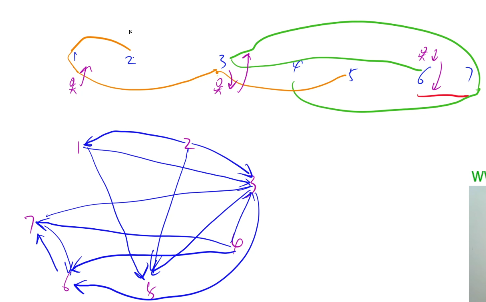
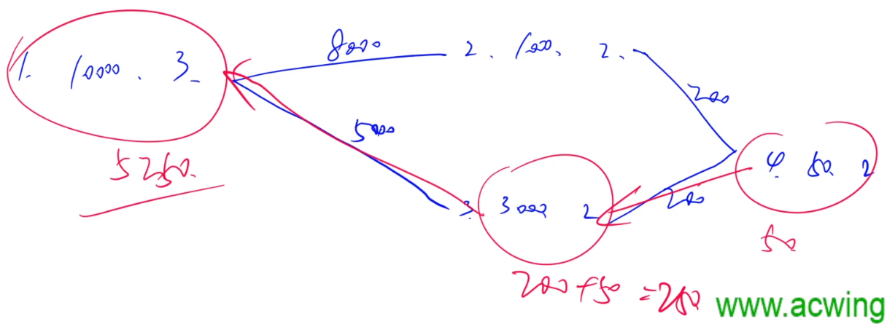
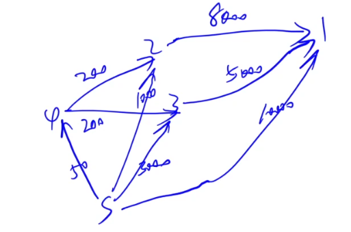
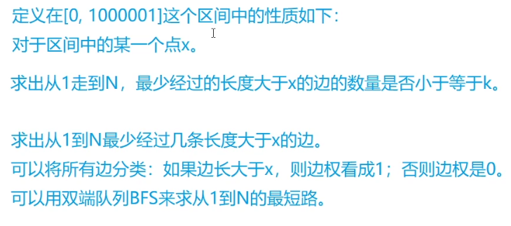
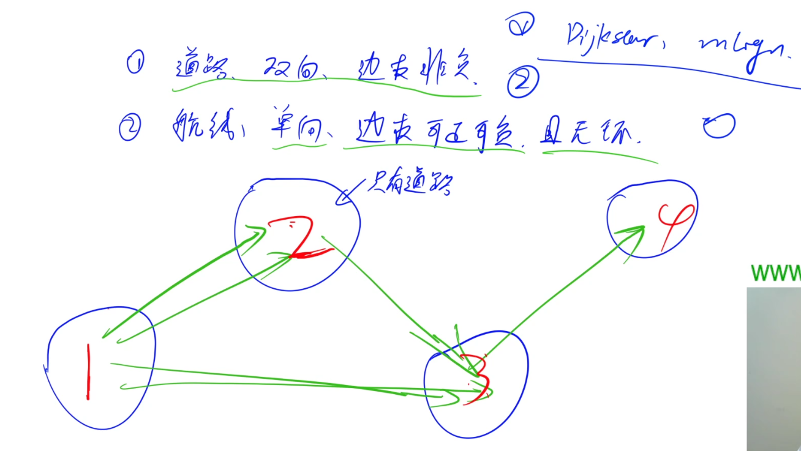
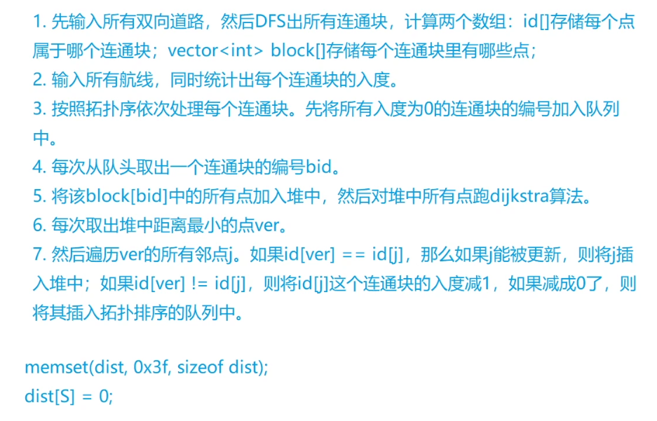

# 单源最短路

> 2024.01.02, 15:44

单源最短路主要分为两大类：

1. 边权均非负
   1. 朴素Dijkstra
   2. 堆优化Dijkstra
2. 有负权边
   1. Bellman-Ford
   2. SPFA

- **图论的题目难点在于问题的转换和抽象。**

****

## 简单应用

- 本小节主要讲图论问题的一般建图方式。

> 如何把一个问题转换成图论的问题才是关键，只要能够转换，就可以直接默写图论的代码模板速A了。

### 1. [热浪](http://ybt.ssoier.cn:8088/problem_show.php?pid=1379)

- 思路

最简单的单源最短路模型。根据题目所给的范围选择使用的算法，可以发现3种算法：`朴D`、`优D`、`spfa`都可以过，因此选择一个最熟悉的写就可以了。

- [代码](E:\codes\C++\AcwingTest\热浪.cpp)

****

### 2. [信使](http://ybt.ssoier.cn:8088/problem_show.php?pid=1376)

- 思路

本题本质上是一个“广播”模型，每个点接收到信息后会立即向与该点有边的点发送广播（存在反向广播）。求整个网络所有点都接收到信息共需要多少时间？

**核心**：对于每个点来说，它接收到信的时间就是它到指挥部的最短路径。

**其实就是求起点到所有其他点的最短距离中的最大值。**

- 由于本题的`N`很小，因此完全可以用`Floyd`算法来做，因为`Floyd`算法的代码很短。

- [代码](E:\codes\C++\AcwingTest\信使.cpp)

****

### 3. [香甜的黄油](https://www.acwing.com/problem/content/1129/)

- 思路

抽象成图论问题：先设定一个起点，然后算一下每头牛到该点的最短距离之和作为该点的花费。最后枚举每个点作为起点，找出其中花费最小的点作为答案输出。

因此，本题实际上是一个多源汇最短路问题。标准做法是`Floyd`，但是本题大概率会T，怎么优化呢？

① `朴D`：$O(n^3)$，显然也不能用。

② `优D`：$O(n\times m\log n)$，约等于$1450\times 800 \times \log 800 \approx 11600000$，可以AC。

③`spfa`：$O(nm)$，差不多$800\times 1450 = 1160000$，可以AC。需要注意spfa有概率被卡。

- [代码](E:\codes\C++\AcwingTest\香甜的黄油.cpp)

****

### 4. [最小花费](http://ybt.ssoier.cn:8088/problem_show.php?pid=1344)

- 思路

求A最少需要发多少钱，使得B可以收到100块。其中`A->B`的转账路线是由A决定的。

抽象模型：将手续费看作是边上权重$w(0<w\le 1)$，使得$d(y)=d(x)·w$。因此从A走到B，等价于$d(B) = d(A)·w_1·w_2 \cdots w_k$，求$d(A)$的最小值使得$d(B)=100$，等价于让$w_1w_2\cdots w_k$最大，因此就是求从A走到B的所有路径中**乘积最大**的那条路径，特别像最短路问题（求总和最小的一条路径）。 

- 要使得乘积最大，应该怎么做呢？

$\log (w_1w_2\cdots w_k) = \log w_1 + \log w_2 + \cdots + \log w_k$，由于$log$函数单调递增，因此要想使$w_1w_2\cdots w_k$，等价于让$\log (w_1w_2\cdots w_k)$ 最大，即让$\log w_1 + \log w_2 + \cdots + \log w_k$最大，由于$0<w\le 1$，因此$\log w_i \le 0,i\in [1, k]$，相当于求从A走到B使得$\log w_i$之和最大，对每个$\log w_i$取相反数，使得每条边都是非负边，此时就等价于求`A->B`的最短路径了。**所以这道题的本质就是：给我们一个边权都大于等于0的无向图，求出从起点走到终点的最短路径。**

> **注意：**
>
> 由于本题有个限制：$0<w<1,即 \log w_i \ge 0$，因此可以做到每条边权都是非负的。所以本题既可以用`朴D、优D`来做，也可以用`spfa`来做。
>
> 如果没有这个限制，就意味着每条边的权重可正可负，此时就只能用`spfa`来做了。

- 在代码的具体实现中，**直接用乘法替换加法即可**，没必要真正用`log`来表示边权。

- [代码](E:\codes\C++\AcwingTest\最小花费.cpp)

****

### 5. [最优乘车](https://www.acwing.com/problem/content/922/)

- 思路

抽象模型：把每个车站看作是一个点，可以做出下图，图中每条边权都是1。

其中每条单程路线分别为：`2->1->3->5`、`4->7->3->6`、`6->7`。

这样就转换成了求从起点到终点的最短路径问题了。

- 对于每条公交路线，对每个点它之后能够到达的每一个点都连一条权重为`1`的边，表示从当前这个点坐到那个点只需要搭一趟车。

- 最终答案：换乘次数 = 从起点坐到终点最少需要坐的车数 - 1
- 特判：若起点等于终点，坐车次数和换车次数都是0
- 由于本题边权都是1，因此直接写一个BFS就可以了，不用写那么麻烦的Dijkstra和spfa。

- [代码](E:\codes\C++\AcwingTest\最优乘车.cpp)

****

### 6. [昂贵的聘礼](http://poj.org/problem?id=1062)

- 思路

样例解释：

先花50块买`物品4`，再用`物品4`+200块换`物品3`，再用`物品3`+5000块换`物品1`。总花费：5250块。

抽象模型：找出起点和终点。终点很简单，就是目标物品（1号物品），起点呢？

**建图**：

**构造一个虚拟源点`S`**：`S`为虚拟源点，表示直接买。

我们可以发现：**原问题中任何一种购买策略都可以对应一条从`S`走到`1`的路线，反过来，任何一条购买方式都可以对应一条从S走到1号点的路径。两者一一对应。**购买花费恰好等于从`S`到`1`号点的距离之和，因此求的就是从`S`到`1`号点的最短路径。

- 考虑等级限制该怎么做呢？

很简单，由于等级限制最多只有100，因此可以暴力枚举每个等级区间，每个区间更新一下答案即可。因为区间最多只有100个，节点个数也只有100个，因此`朴D`就能过。

- [代码](E:\codes\C++\AcwingTest\昂贵的聘礼.cpp)

****

### 7. 其他应用题

- [最短距离](https://www.acwing.com/problem/content/description/1490/)（虚拟源点，优D）
- [奶牛回家](https://www.acwing.com/problem/content/1377/)（spfa）
- [Dijkstra序列](https://www.acwing.com/problem/content/description/4278/)（朴D）
- 

****

## 综合运用

本小节主要讲**单源最短路问题和其他算法的结合**。

其他算法主要包括：DFS、二分、DP、拓扑排序

直接看题目。

### 1. [新年好](http://ybt.ssoier.cn:8088/problem_show.php?pid=1500)（最短路+DFS）

- 思路

> 本题N范围50000，M范围$10^5$。

考虑暴力怎么做，一共五个亲戚`a b c d e`，因此有$5!$种拜访顺序。

当我们顺序确定之后，它就是一个单源最短路问题，求一下拜访序列中相邻两个点之间的最短距离之和即可。用`spfa`做的时间复杂度为$5! \times 5 \times O(m) = 6 \times 10^7$，但是`spfa`并不是稳定的$O(m)$时间复杂度，因此很有可能会T。

- 考虑怎么优化？

**调整代码的顺序即可。**刚刚的做法是先暴搜，再求5次单源最短路。

我们可以调整顺序：先预处理`1 a b c d e`这6个点到其他亲戚点的最短路径（做6次`spfa`算法），再去做暴搜，暴搜过程中对于每个点的距离直接查表即可，而不需要在暴搜的过程中求最短路。时间复杂度：$6\times O(m) + 5!$。这样就能A了。

- [代码](E:\codes\C++\AcwingTest\新年好.cpp)
- Update: `spfa`寄了，换`优D`。

****

### 2. [通信线路](https://www.acwing.com/problem/content/342/)（最短路+二分）

- 思路

思考二分性质：区间：`l = 0, r = 1e6 + 1`

每次枚举`mid = l + r >> 1`，将大于`mid`的边权赋值为`1`，小于等于`mid`的边权赋值为`0`

这样从`1->N`的路径和`sum`表示经过的边至少有`sum`条花费大于`mid`的边。

假设至少经过`y`条，那么性质的结果就是`y <= k`是否成立。

换言之，求出从1走到N，最少经过的长度大于`mid`的边的数量是否小于等于`k`。

- 本题长度L的范围是`[1, 100000]`，那么二分的区间为什么取`[0, 100001]`呢？

从实际含义出发，考虑答案是否可能取到0？是可能取到0的。那为什么右端点取100001呢？如果1和N不连通，那么若二分返回的答案是100000，我们是不能判断1和N是不连通的，因为100000也有可能作为答案输出，因此需要取100001来表示无解的情况。

- 如何求出从1走到N，最少经过的长度大于`x`的边的数量是否小于等于`k`？

  1. 先求出从1到N最少经过几条长度大于`x`的边。可以将所有边分类：若边长大于`x`，则边权看成1，否则边权是0。

  2. 可以用双端队列BFS来求从1到N的最短路（如果一个图中的边权只有0或1，那么求最短路可以用双端队列广搜来做，时间复杂度是线性的）。

- 时间复杂度：$O((N + P)\times \log L) \approx 200000$。

- [代码](E:\codes\C++\AcwingTest\通信线路.cpp)

****

### 3. [道路与航线](https://www.acwing.com/problem/content/344/)（最短路+拓扑序）

- 思路

有两种路线：一种是`道路（双向、边权非负）`，另一种是`航线（单向、边权可正可负、且无环）`。

求`S`到其他所有点的最短距离，点数25000，边数50000。注意：本题`spfa`会被卡。

> 已知：
>
> 1. 如果边权非负，那么可以用Dijkstra算法，时间复杂度是$O(m\log n)$。
> 2. 如果是拓扑图，那么不管边权是正是负，均可用拓扑序扫描，时间复杂度是线性的。

先把**只含道路**的每个点看作一个团（连通块），再把每个团看作一个点，点与点之间的边是航线（单向），这样就构成了一张拓扑图，**然后按照拓扑序用Dijkstra算法处理每个团**。这样的话，时间复杂度就是$O(m\log n + (n+m))=O(m\log n)$。 

- 算法流程

- [代码](E:\codes\C++\AcwingTest\道路与航线.cpp)

****

### 4. [最优贸易](https://www.acwing.com/problem/content/343/)

- 思路

- [代码](E:\codes\C++\AcwingTest\最优贸易.cpp)

****

## 扩展应用

