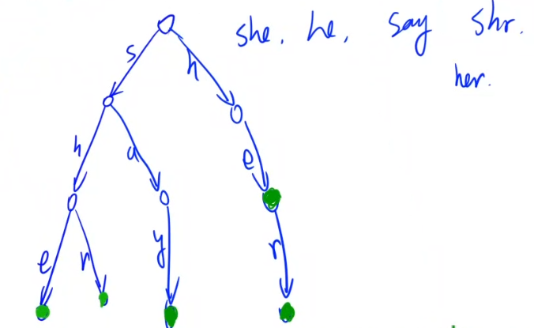
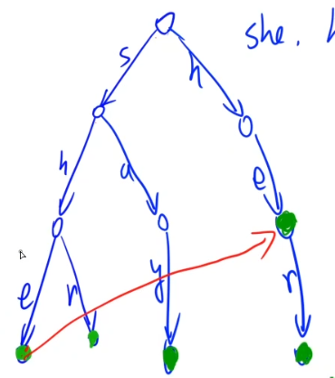
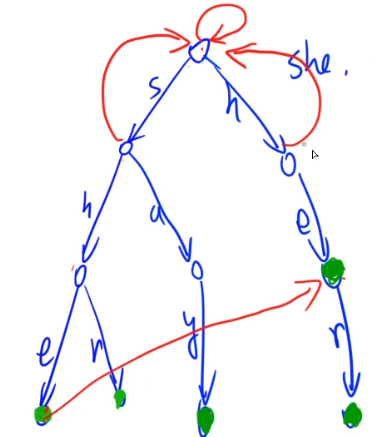
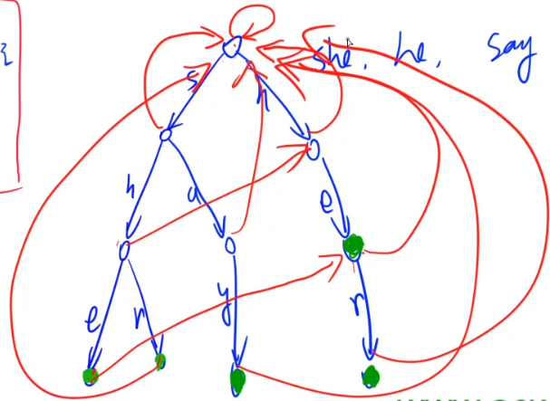

# AC自动机

> 本小节会把之前动态规划（DP）章节中留下的题目“[修复DNA]()”给顺便讲掉。

- [AC自动机](https://oi-wiki.org/string/ac-automaton/)，就是 Tire + KMP 的结合版。

- AC自动机还有一个小扩展（小优化） => **Tire图**，本质上就是AC自动机，时间复杂度与AC自动机是一样的，大部分情况下效率与AC自动机差不多，只不过可能会快一点点。**但是，代码会稍微短一些！**所以，一般情况下我们会选择写Tire图。

- KMP的核心：`next[i]:`在模式串p中，以`p[i]`结尾的后缀能够匹配的从1开始的**非平凡**前缀的最大长度。

- KMP的代码

```c++
// 求next的过程：母串s和模式串p下标均从1开始，n为s的长度，m为p的长度
next[0] = next[1] = 0;  // 特判。可省略不写，因为全局数组next默认初始化为0
for (int i = 2, j = 0; i <= m; i ++ )
{
    while (j && p[i] != p[j + 1]) j = next[j];
    if (p[i] == p[j + 1]) j ++ ;
    next[i] = j;
}
```

- 构建`Tire`树，如下图所示：



- 把Tire树看作是KMP中的一个数组，不同于KMP在一维数组上建立`next`数组，AC自动机就是在Tire树的基础上建立一个`next`数组。

每个绿色的点的next指针指向其非平凡后缀对应的最长前缀的尾端点，例如上图中`she`的最长后缀`he`对应的最长前缀为`her`中的`he`，因此`she`中的`e`的next指向`her`中的`e`。如下图所示：



如何每个模式串查找是否存在最长后缀呢？其实就是Tire的一个简单实现，依次看每个字符串的每个后缀，在Tire树中寻找它对应的前缀，然后更新最大值即可。例如，先看`she`的后缀`e`，发现Tire树中没有前缀是`e`的，继续看下一个后缀`he`，在Tire树中找到它对应的前缀`he`，更新`e`的next指针指向`he`的尾端点`e`，至此，字符串`she`遍历结束。

KMP代码中的`next[0] = next[1] = 0;`这句代码对应在Tire树中如下图所示：



即根节点指向自身，以及第一个字符也指向根节点。每个不存在后缀与前缀相等的节点都指向根节点。

- 最终整棵Tire树如下图所示：



- KMP代码中的这一段代码对应AC自动机：

```c++
for (int i = 2; i <= m; i ++ )
{
    int j = next[i - 1];  // 换成这样写与上面功能相同，且更直观
    while (j && p[i] != p[j + 1]) j = next[j];
    if (p[i] == p[j + 1]) j ++ ;
    next[i] = j;
}
```

我们发现`j`使用的是上一层`next[i - 1]`的信息，因此对应AC自动机中也是用上一层更新下一层的。

- AC自动机中每次都是用当前层的信息来更新后一层的信息。由于是一层一层遍历的，因此，应该用BFS来做。
- AC自动机的构造方式：

```c++
while (hh <= tt)
{
    t = q[hh ++ ];  // 这个t对应的就是kmp中的i-1
    for (int i = 0; i < 26; i ++ )  // 假设最多有26个字母参与匹配
    {
        c = tr[t][i];  // tr[t][i]指的是t的第i个儿子，此时c对应的就是i，即t的下一个字母
        j = next[t];  // j对应的kmp中的j
        // 这里!tr[j][i]判断j的下一个字母是i（i对应的kmp中的p[i]）是否成立，对应p[i] != p[j + 1]
        while (j && !tr[j][i]) j = next[j];
        if (tr[j][i]) j = tr[j][i];
        next[c] = j;
    }
}
```

****

### 1. [搜索关键字](http://ybt.ssoier.cn:8088/problem_show.php?pid=1479)（模板题）

- 思路

> AC自动机可以在$O(n)$的时间复杂度内求出来每一个单词在母串中是否出现过，出现多少次。

把上述AC自动机的原理实现一遍就行了。

#### AC自动机代码

- [代码](E:\codes\C++\AcwingTest\搜索关键字.cpp)

```c++
#include <iostream>
#include <algorithm>
#include <cstring>

using namespace std;

const int N = 10010, S = 55, M = 1000010;

int n;
int tr[N * S][26], cnt[N * S], idx;
char str[M];
int q[N * S], ne[N * S];

void insert()
{
    int p = 0;
    for (int i = 0; str[i]; i ++ )
    {
        int t = str[i] - 'a';
        if (!tr[p][t]) tr[p][t] = ++ idx;
        p = tr[p][t];
    }
    cnt[p] ++ ;
}

void build()
{
    int hh = 0, tt = -1;
    for (int i = 0; i < 26; i ++ )
        if (tr[0][i])
            q[ ++ tt] = tr[0][i];
    
    while (hh <= tt)
    {
        auto t = q[hh ++ ];
        for (int i = 0; i < 26; i ++ )
        {
            int c = tr[t][i];
            if (!c) continue;  // 若不存在该儿子，直接continue

            int j = ne[t];
            while (j && !tr[j][i]) j = ne[j];
            if (tr[j][i]) j = tr[j][i];
            ne[c] = j;
            q[ ++ tt] = c;  // 最后把c加入队列
        }
    }
}

signed main()
{
    int T; cin >> T;
    while (T -- )
    {
        memset(tr, 0, sizeof tr);
        memset(cnt, 0, sizeof cnt);
        memset(ne, 0, sizeof ne);
        idx = 0;

        cin >> n;
        for (int i = 0; i < n; i ++ )
        {
            cin >> str;
            insert();
        }

        build();

        cin >> str;  // 读入母串
        
        int res = 0;
        for (int i = 0, j = 0; str[i]; i ++ )
        {
            int t = str[i] - 'a';
            while (j && !tr[j][t]) j = ne[j];
            if (tr[j][t]) j = tr[j][t];

            int p = j;  // 同时把j能够走到的点全部遍历一遍
            while (p)
            {
                res += cnt[p];
                cnt[p] = 0;
                p = ne[p];
            }
        }

        cout << res << endl;
    }
    
    return 0;
}
```

#### Tire图代码

- 优化成`Tire图`，一看就是$O(n)$。

```c++
#include <iostream>
#include <algorithm>
#include <cstring>

using namespace std;

const int N = 10010, S = 55, M = 1000010;

int n;
int tr[N * S][26], cnt[N * S], idx;
char str[M];
int q[N * S], ne[N * S];

void insert()
{
    int p = 0;
    for (int i = 0; str[i]; i ++ )
    {
        int t = str[i] - 'a';
        if (!tr[p][t]) tr[p][t] = ++ idx;
        p = tr[p][t];
    }
    cnt[p] ++ ;
}

void build()
{
    int hh = 0, tt = -1;
    for (int i = 0; i < 26; i ++ )
        if (tr[0][i])
            q[ ++ tt] = tr[0][i];
    
    while (hh <= tt)
    {
        auto t = q[hh ++ ];
        for (int i = 0; i < 26; i ++ )
        {
            int p = tr[t][i];
            // 优化掉while
            if (!p) tr[t][i] = tr[ne[t]][i];
			else
            {
                ne[p] = tr[ne[t]][i];
                q[ ++ tt] = p;
            }
        }
    }
}

signed main()
{
    int T; cin >> T;
    while (T -- )
    {
        memset(tr, 0, sizeof tr);
        memset(cnt, 0, sizeof cnt);
        memset(ne, 0, sizeof ne);
        idx = 0;

        cin >> n;
        for (int i = 0; i < n; i ++ )
        {
            cin >> str;
            insert();
        }

        build();

        cin >> str;  // 读入母串
        
        int res = 0;
        for (int i = 0, j = 0; str[i]; i ++ )
        {
            int t = str[i] - 'a';
            j = tr[j][t];  // 优化掉while

            int p = j;  // 同时把j能够走到的点全部遍历一遍
            while (p)
            {
                res += cnt[p];
                cnt[p] = 0;
                p = ne[p];
            }
        }

        cout << res << endl;
    }
    
    return 0;
}
```

****

### 2. [DNA修复](http://poj.org/problem?id=3691)

- 思路

先回顾一下状态机模型的DP是怎么做的，建议先看一下“**设计密码**”这道题。

> `f[i, j]`: 表示当前走到了第`i`个字母，并且当前走到了AC自动机中的第`j`个位置的所有操作方案中的最少修改的字母数量。


- [代码]()
