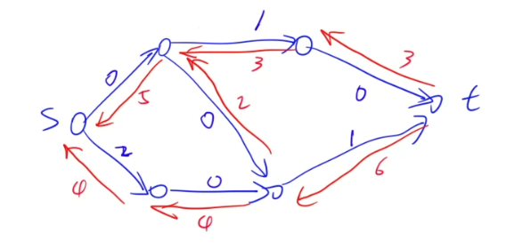
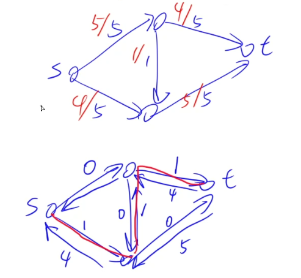

# 网络流

## 网络流的基本概念

- 基本概念预览

### 流网络

流网络是一个有向图，可以有环。图中有两个特殊的点：**源点(s)**和**汇点(t)**。图中每条边都有一个属性，叫做流网络的**容量**。可以把源点想象成一个水库，汇点想象成大海，容量想象成水的流速或者河流宽度等，会有源源不断的水从源点流向汇点，这就叫做流网络。**G=(V, E)**

为了简化问题，假定图中不存在反向边。如果有反向边的话也可以把它变成一个没有反向边的图，在反向边上加一个点即可，如图所示 => 。因为我们在考虑问题时是可以假定图里没有反向边的。

> 如果顶点u和v之间不存在边，则将容量c定义成0：$c(u,v)=0$

### 可行流

可行流一般用$f$来表示，指的是指定每一条边上的容量，但是需要满足两个条件：

1. 容量限制。$0\le f(u,v)\le c(u,v)$

2. 流量守恒。指的是所有顶点中除了源点和汇点之外，其他点都不能存储容量。

   即$\forall x\in V-\{st\}$，流入的流量一定等于流出的流量：$\Sigma_{(v,x)\in E} f(v,x) = \Sigma_{(x,v)\in E}f(x,v)$

上述条件中完全不考虑反向边。

- 可行流的流量值：$|f|$，表示从源点流向汇点的速度是多少。

公式：$|f|=\Sigma_{(s,v)\in E}f(s,v) - \Sigma_{(v,s)\in E}f(v,s)$，指的是流出去的容量减去流入的容量。（一般流网络中没有后面那一项）

### 最大流

最大流全称**最大可行流**，指的是流网络中流量值$|f|$最大的一个可行流。

****

> 如下图所示，是一个合法的流网络：
>
> 

****

### 残留网络

残留网络是对于流网络的某一条可行流来说的。残留网络与可行流一一对应，可行流不同，残留网络也不同。

- 残留网络一般记成$G_f$。

- 残留网络的点集与原流网络的点集是一样的，边集不仅包含原流网络的所有边E，还包含E里面的所有反向边。容量的定义：$c'(u,v) =  \left\{\begin{matrix}
  c(u,v)-f(u,v)\quad (u,v)\in E \\f(v, u)\qquad\quad (v,u)\in E \end{matrix}\right.$

- 对于任何一个可行流$f$，都可以求出它的残留网络$G_f$。

> 如下图所示，是上一张图的残留网络：
>
> 

残留网络也是一个流网络，因此它也可以求出来一个可行流$f'$。

- **原网络的可行流$f$加上其残留网络的可行流$f'$也是原网络$G$的一个可行流。进一步可以得到，$|f+f'| = |f| + |f'|$。**

- 证明

验证得到的可行流是否满足`可行流的条件`。

1. $0\le f'(u,v)\le c'(u,v)=c(u,v)-f(u,v)$

   $=> 0\le f'(u,v)\le c(u,v)-f(u,v)$

   $=> 0\le f'(u,v)+f(u,v)\le c(u,v)$ 成立，情况一合法。

2. $0\le f'(u,v)\le c'(u,v)=f(v,u)\le c(v,u)$

   $=> 0\le f(v,u)-f'(u,v)\le c(u,v)$ 成立，情况二合法。

因此条件一`容量限制`满足。

对于原网络中可行流流入的量等于流出的量，并且残留网络中可行流流入的量也等于流出的量，将两个流相加后，因此条件二`流量守恒`也满足。

证毕。

> 可行流相加，指的是每条边对应相加。原网络的一条边的流量 + 残留网络的对应边的流量（方向相同则累加到原网络中去，相反则用原网络流量减去残留网络对应边的流量）。

- **推论**：若残留网络中存在可行流且该可行流大于0，那么原网络的可行流一定不是最大可行流。反过来也成立：若残留网络中不存在可行流，那么原网络的可行流一定是最大可行流。

### 增广路径

在残留网络中，从源点出发，沿着容量大于0的边，若能够走到终点，那么这条路径就被称为**增广路径**。

如图所示：

上图红色路径就是一条增广路径。

增广路径指的就是一个最简单的容量大于0的一个可行流。

定理：如果对于当前的可行流$f$来说，在它的残留网络$G_f$里，如果没有增广路径的话，就可以断定$f$是一个最大流。（该定理的证明需要引入到后面`割`的概念）

### 割

割，指的是将流网络的点集$V$分成两个子集：$S$和$T$。满足$S\cup T = V，S\cap T = \varnothing$。

$V\left\{\begin{matrix}
 S，S\cup T = V,S\cap T = \varnothing \\ T， s\in S,t\in T \end{matrix}\right.$

- 割的容量：$c(S,T)=\Sigma_{u\in S}\Sigma_{v\in T} c(u,v)$，即所有从S指向T的边的容量之和。
  - 割的数量总共有$2^{n-2}$个，其中**容量最小的割被称为最小割**。（注意是容量，不是流量！！）

- 割的流量：$f(S,T)=\Sigma_{u\in S}\Sigma_{v\in T}f(u,v)-\Sigma_{u\in T}\Sigma_{v\in S}f(u,v)$

> **性质1：对于任意一个割，都有：割的流量一定等于小于割的容量。即 $\forall [S,T]\forall f, f(S,T)\le c(S,T)$。**

> **性质2：对于任意可行流$f$，任意割$[S, T]$，都有：$|f| = f(S,T)$。**
>
> 证明可以参考胡伯涛的[《最小割在信息学竞赛中的应用》](https://github.com/tiankonguse/ACM/blob/master/Network%20Flow%2C%20%E7%BD%91%E7%BB%9C%E6%B5%81/Resource%2C%20%E8%B5%84%E6%96%99/7.%E8%83%A1%E4%BC%AF%E6%B6%9B%E3%80%8A%E6%9C%80%E5%B0%8F%E5%89%B2%E6%A8%A1%E5%9E%8B%E5%9C%A8%E4%BF%A1%E6%81%AF%E5%AD%A6%E7%AB%9E%E8%B5%9B%E4%B8%AD%E7%9A%84%E5%BA%94%E7%94%A8%E3%80%8B.pdf)

> **性质3：对于任意可行流$f$，任意割$[S, T]$，都有：$|f|\le c(S,T)$。即 最大流 < 最小割**

****

### 最大流最小割定理（重要）

1. 可行流$f$是最大流

2. 可行流$f$的残留网络中不存在增广路
3. 存在某个割$[S,T]$，使得$|f|=c(S,T)$

**这三条性质互相等价，其中任意一个成立，其他两个也一定成立。**

- 证明（重要）

①=>②：反证法。若f是最大流，且残留网络中存在大于0的增广路，那么有$|f+f'|=|f|+|f'|>|f|$，与$|f|$最大矛盾

③=>①：利用割的第三个性质：`对于任意可行流f，任意割[S, T]，都有|f| <= c(S,T)`，`最大流 < 最小割c(S,T)`，要想证明$|f|$最大，因为$最大流\ge |f|$，因此只需证明$|f|\ge 最大流$，因为$|f|=c(S,T)\ge 最大流$。因此，$|f|=最大流$。证毕。在这里还可以证明得到$最小割\le c(S,T)=|f|\le 最大流$，即最小割 = 最大流。

②=>③：在满足条件②的前提下，构造一个割使得它满足条件③。构造集合S：在$G_f$中，从s点出发沿着容量大于0的边走，所有能走到的点（由于$G_f$中不存在增广路，因此t不可能属于集合S）。构造集合T：$T-V-S$。这样就一定满足源点s属于集合S，汇点t属于集合T，并且$S\cap T = \varnothing$，该[S, T]就是一个合法的割。对于$\forall x\in S,\forall y\in T, 存在f(x,y)=c(x,y)$，对于$\forall a\in T,\forall b\in S, 存在f(a,b)=0$。所以有$|f| = f(S,T) = \Sigma_{u\in S}\Sigma_{v\in T}f(u,v) - \Sigma_{u\in T}\Sigma_{v\in S}f(u,v) = \Sigma_{u\in S}\Sigma_{v\in T}f(u,v) - 0 = \Sigma_{u\in S}\Sigma_{v\in T}f(u,v) = c(S,T)$。证毕。

****

> EK算法思路：给定一个原网络，维护一个残留网络，每次迭代：①在当前残留网络中找增广路（BFS），②更新残留网络$G_f$ -> $G_{f+f'}$。
>
> EK算法在求最大流的时候一般是用不到的，但是在求最小费用流时EK算法是核心算法。

> `EK`算法的时间复杂度：$O(nm^2)$，看起来慢，实际上运行效率非常高。一般处理`1000~10000`的网络没啥问题。
>
> `Dinic`算法的时间复杂度：$O(n^2m)$，一般处理`10000~100000`的网络都没啥问题。
>
> `Dinic`算法和`ISAP`算法的效率差不多，挑一个背即可，推荐背`Dinic`算法。
>
> 还有更高效率的`HLPP`算法，但是一般用不到，出题人不会特意卡这个算法的。感兴趣可以背一下。
