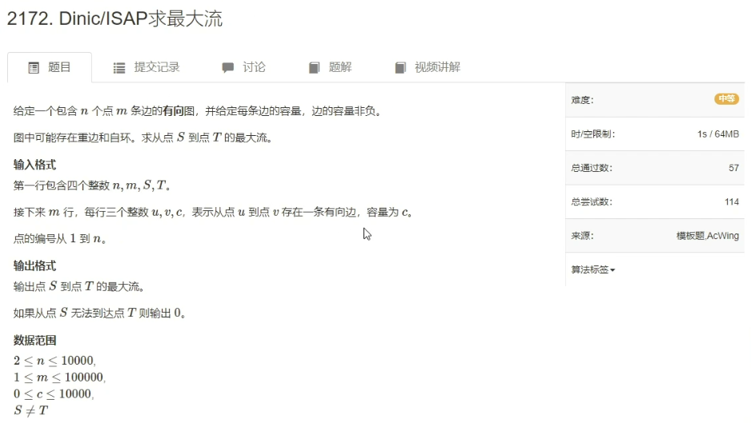

# 最大流算法

## 算法模板

### EK算法

- 时间复杂度：$O(n m^2)$

- 怎么存流网络图？

用邻接表存储。成对存储，这样找反向边的时候只需要对1异或即可。

- 题目


- 代码

```C++
#include <iostream>
#include <algorithm>
#include <cstring>

using namespace std;

const int N = 1010, M = 20010, INF = 1e8;

int n, m, S, T;
int h[N], e[M], f[M], ne[M], idx;  // f[]表示容量
int q[N], d[N], pre[N];  // d[i]表示从源点走到点i的路径上的所有边的容量的最小值
bool st[N];

void add(int a, int b, int c)
{
	e[idx] = b, f[idx] = c, ne[idx] = h[a], h[a] = idx ++ ;
	e[idx] = a, f[idx] = 0, ne[idx] = h[b], h[b] = idx ++ ;  // 建立反向边
}

bool bfs()  // bfs找增广路
{
	int hh = 0, tt = 0;
	memset(st, 0, sizeof st);
	q[0] = S, st[S] = true, d[S] = INF;
	while (hh <= tt)
	{
		int t = q[hh ++ ];
		for (int i = h[t]; ~i; i = ne[i])
		{
			int ver = e[i];
			if (!st[ver] && f[i])
			{
				st[ver] = true;
				d[ver] = min(d[t], w[i]);
				pre[ver] = i;  // 记录前趋边
				if (ver == T) return true;  // 找到终点，返回true
				q[ ++ tt] = ver;
			}
		}
	}
	return false;
}

int EK()
{
	int r = 0;
	while (bfs())
	{
		r += d[T];
		for (int i = T; i != S; i = e[pre[i] ^ 1])
			f[pre[i]] -= d[T], f[pre[i] ^ 1] += d[T]; // 更新
	}
	return r;
}

signed main()
{
	cin >> n >> m >> S >> T;
	memset(h, -1, sizeof h);
	while (m -- )
	{
		int a, b, c;
		cin >> a >> b >> c;
		add(a, b, c);
	}
	
	cout << EK() << endl;
	
	return 0;
}
```

****

### Dinic算法

- 时间复杂度：$O(n^2 m)$

- 思想与EK算法的思想是一样的，基于`最大流最小割定理`。

**即如果可行流$f$对应的残留网络$G_f$中不存在增广路，则该可行流$f$就是最大流。**

与EK算法的思想一样，不断在残留网络中寻找增广路，直到找不到增广路为止。

`Dinic算法`对EK算法做了优化：每次增广的时候不止增广一条路，即每次暴搜一下可以增广多少条路，然后把能够增广的路径全部增广一遍。

为了避免存在环而导致死循环的问题，把整张图做成一层一层的。

在增广路径时，严格要求每次路径只能从前一层走到后一层（只能一层一层往后走），直到走到终点为止。

如图所示：

这样就可以保证没有环路了。

> BFS建立分层图：从起点开始BFS，BFS到的点的距离就是这个点的层数。
>
> DFS暴搜分层图中能够增广的路径，统一增广一遍。

- 图的存储方式与EK算法一样，都是存储残留网络。
- `Dinic`算法其实是有很多优化的，其运行效率远比$O(n^2m)$要快得多。
- 题目



- 代码（三个优化都需要掌握）

```c++
#include <iostream>
#include <algorithm>
#include <cstring>

using namespace std;

const int N = 10010, M = 20010, INF = 1e8;

int n, m, S, T;
int h[N], e[M], f[M], ne[M], idx;
int q[N], d[N], cur[N];  // d存储层数，cur用来做优化，表示弧优化

void add(int a, int b, int c)
{
	e[idx] = b, f[idx] = c, ne[idx] = h[a], h[a] = idx ++ ;
	e[idx] = a, f[idx] = 0, ne[idx] = h[b], h[b] = idx ++ ;  // 建立反向边
}

bool bfs()
{
	int hh = 0, tt = 0;
	memset(d, -1, sizeof d);
	q[0] = S, d[S] = 0, cur[S] = h[S];
	while (hh <= tt)
	{
		int t = q[hh ++ ];
		for (int i = h[t]; ~i; i = ne[i])
		{
			int ver = e[i];
			if (d[ver] == -1 && f[i])
			{
				d[ver] = d[t] + 1;  // 更新层数
				cur[ver] = h[ver];  // 当前弧优化
				if (ver == T) return true;
				q[ ++ tt] = ver;
			}
		}
	}
	return false;
}

// u:表示从节点u开始搜，limit:表示从源点流向节点u的最大流量
int find(int u, int limit)
{
	if (u == T) return limit;
	int flow = 0;  // 表示从节点u开始往后走的流量，初始化为0
	for (int i = cur[u]; ~i && flow < limit; i = ne[i])  // 利用弧优化，还有非常重要这个优化：flow < limit，若不满足该条件，则可以直接return
	{
		cur[u] = i;  // 当前弧优化
		int ver = e[i];
		if (d[ver] == d[u] + 1 && f[i])  // 只有在当前层下一层的节点才能搜它
		{
			int t = find(ver, min(f[i], limit - flow));
			if (!t) d[ver] = -1;  // 优化：若从这个点到终点是没有路径的，则可以把该点删掉，层数设为-1即可
			f[i] -= t, f[i ^ 1] += t, flow += t;
		}
	}
	return flow;
}

int dinic()
{
	int r = 0, flow;
	while (bfs()) while (flow = find(S, INF)) r += flow;
	return r;
}

signed main()
{
	cin >> n >> m >> S >> T;
	memset(h, -1, sizeof h);
	while (m -- )
	{
		int a, b, c;
		cin >> a >> b >> c;
		add(a, b, c);
	}
	cout << dinic() << endl;
	
	return 0;
}
```

****

### HLPP算法

即**最高标号预流推进（HLPP）算法**。时间复杂度$O(n^2\sqrt m)$。

具体思路参考：https://oi-wiki.org/graph/flow/max-flow

- 代码

```c++
#include <cstdio>
#include <cstring>
#include <queue>
#include <stack>
using namespace std;
const int N = 1200, M = 120000, INF = 0x3f3f3f3f;
int n, m, s, t;

struct qxx {
  int nex, t, v;
};

qxx e[M * 2 + 1];
int h[N + 1], cnt = 1;

void add_path(int f, int t, int v) { e[++cnt] = (qxx){h[f], t, v}, h[f] = cnt; }

void add_flow(int f, int t, int v) {
  add_path(f, t, v);
  add_path(t, f, 0);
}

int ht[N + 1], ex[N + 1],
    gap[N];  // 高度; 超额流; gap 优化 gap[i] 为高度为 i 的节点的数量
stack<int> B[N];  // 桶 B[i] 中记录所有 ht[v]==i 的v
int level = 0;    // 溢出节点的最高高度

int push(int u) {      // 尽可能通过能够推送的边推送超额流
  bool init = u == s;  // 是否在初始化
  for (int i = h[u]; i; i = e[i].nex) {
    const int &v = e[i].t, &w = e[i].v;
    if (!w || init == false && ht[u] != ht[v] + 1 ||
        ht[v] == INF)  // 初始化时不考虑高度差为1
      continue;
    int k = init ? w : min(w, ex[u]);
    // 取到剩余容量和超额流的最小值，初始化时可以使源的溢出量为负数。
    if (v != s && v != t && !ex[v]) B[ht[v]].push(v), level = max(level, ht[v]);
    ex[u] -= k, ex[v] += k, e[i].v -= k, e[i ^ 1].v += k;  // push
    if (!ex[u]) return 0;  // 如果已经推送完就返回
  }
  return 1;
}

void relabel(int u) {  // 重贴标签（高度）
  ht[u] = INF;
  for (int i = h[u]; i; i = e[i].nex)
    if (e[i].v) ht[u] = min(ht[u], ht[e[i].t]);
  if (++ht[u] < n) {  // 只处理高度小于 n 的节点
    B[ht[u]].push(u);
    level = max(level, ht[u]);
    ++gap[ht[u]];  // 新的高度，更新 gap
  }
}

bool bfs_init() {
  memset(ht, 0x3f, sizeof(ht));
  queue<int> q;
  q.push(t), ht[t] = 0;
  while (q.size()) {  // 反向 BFS, 遇到没有访问过的结点就入队
    int u = q.front();
    q.pop();
    for (int i = h[u]; i; i = e[i].nex) {
      const int &v = e[i].t;
      if (e[i ^ 1].v && ht[v] > ht[u] + 1) ht[v] = ht[u] + 1, q.push(v);
    }
  }
  return ht[s] != INF;  // 如果图不连通，返回 0
}

// 选出当前高度最大的节点之一, 如果已经没有溢出节点返回 0
int select() {
  while (B[level].size() == 0 && level > -1) level--;
  return level == -1 ? 0 : B[level].top();
}

int hlpp() {                  // 返回最大流
  if (!bfs_init()) return 0;  // 图不连通
  memset(gap, 0, sizeof(gap));
  for (int i = 1; i <= n; i++)
    if (ht[i] != INF) gap[ht[i]]++;  // 初始化 gap
  ht[s] = n;
  push(s);  // 初始化预流
  int u;
  while ((u = select())) {
    B[level].pop();
    if (push(u)) {  // 仍然溢出
      if (!--gap[ht[u]])
        for (int i = 1; i <= n; i++)
          if (i != s && ht[i] > ht[u] && ht[i] < n + 1)
            ht[i] = n + 1;  // 这里重贴成 n+1 的节点都不是溢出节点
      relabel(u);
    }
  }
  return ex[t];
}

int main() {
  scanf("%d%d%d%d", &n, &m, &s, &t);
  for (int i = 1, u, v, w; i <= m; i++) {
    scanf("%d%d%d", &u, &v, &w);
    add_flow(u, v, w);
  }
  printf("%d", hlpp());
  return 0;
}
```


****

## 二分图匹配

****

## 上下界可行流

****

## 多源汇最大流